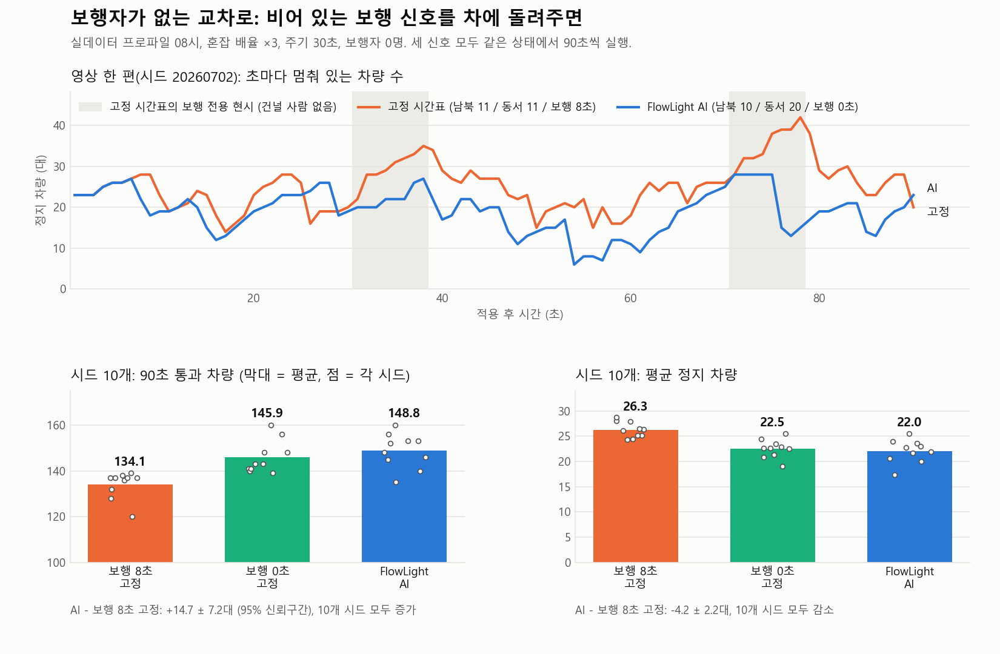
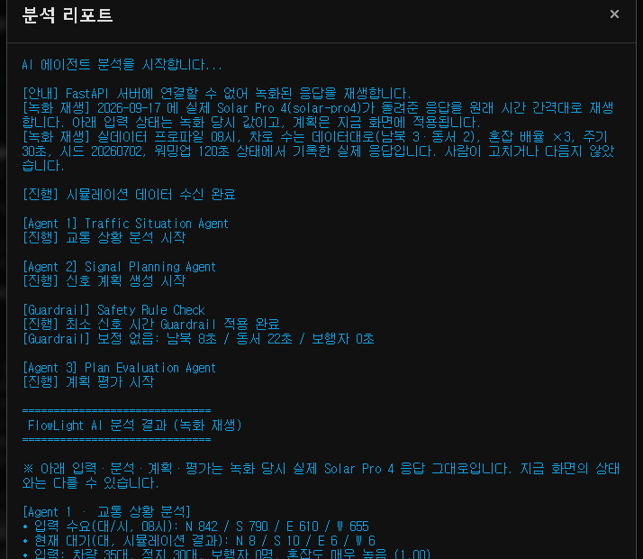

# 🚦 FlowLight

<p align="center">
  
</p>

<div align="center">

# AI-based Real-Time Traffic Signal Optimization

### A multi-agent traffic signal demo built on Upstage Solar Pro 4

**FastAPI · SSE · Solar Pro 4 · Structured Outputs · Guardrail · Traffic Simulator**

[한국어](README.md) · **English**

</div>

---

## 🎬 Live Demo

From the first-run guide to the real-data profile, the AI analysis and the applied signal plan.

<p align="center">
  
</p>

---

# 📌 About the project

FlowLight replaces a fixed-time signal with **three LLM agents** that read the traffic situation, plan the green times and then grade their own plan.
It started from two ideas: **skip the pedestrian phase when nobody is at the crosswalk so vehicles keep moving, and give children, the elderly and wheelchair users more crossing time when they are.**
Every LLM answer is forced into a fixed shape with **Structured Outputs (JSON Schema)**, passes through a rule-based **Guardrail**, and only then reaches the simulator.
FastAPI streams each step over SSE (Server-Sent Events), so you can watch the decision being made.

The repository is being turned into an official Upstage demo and tutorial. Two rules hold throughout:

- Real **hourly traffic volume** is converted into a **vehicle arrival rate** that spawns cars in the simulator. The **queue** (waiting vehicles) is always a simulation result.
  A volume of 842 vehicles per hour is never treated as 842 waiting cars.
- The model's internal reasoning is never switched on. The screen shows only the `summary` / `explanation` / `reason` fields the agents **explicitly return**.

---

## 📊 Before and after AI

This is an intersection with no pedestrians at all. A **fixed timetable** that gives an 8 s pedestrian phase every cycle, whether or not anyone is there, and **the plan Solar Pro 4 produced** each run for 90 seconds from the same seeded state (the GIFs show one frame every 3 seconds). The only difference between the two runs is the signals.

| Before AI (fixed timetable: NS 11 s / EW 11 s / pedestrian 8 s) | After AI (NS 10 s / EW 20 s / pedestrian 0 s) |
|----------|---------|
|  |  |

| Metric (the 90 s in these GIFs) | Fixed timetable | FlowLight AI |
|:--|--:|--:|
| 🚦 Throughput | 138 | **156** |
| 🚗 Mean stopped vehicles | 25.2 | **19.1** |
| ⏱ Mean wait | 15.1 s | **12.3 s** |

<p align="center">
  
</p>

The chart shows, for the 90 s in the GIFs, how many cars are stopped each second (grey bands = the fixed timetable giving a pedestrian phase to an empty crosswalk), plus the ten-seed means (bars) and every seed (dots) from the comparison below. The chart labels are in Korean. Every grey band is followed by a jump in stopped cars on the fixed side.

- On the left every car stops for 8 s each cycle even though nobody is waiting to cross; 16 of the 90 seconds were pedestrian-only phase. On the right the pedestrian time is 0 s, so traffic keeps moving.
- These GIFs come from one real Solar Pro 4 call at seed 20260702 after a 120 s warm-up (35 cars, 30 stopped): main direction "east-west", plan 10/20/0, no Guardrail correction, score 88, auto apply.
- The gap in this one clip (+18 throughput) is a little larger than the ten-seed mean (+14.7). It was a separate call made for the video, so its plan differs from the same seed's row in the ten-seed run (plan 12/18/0, +8). Use the ten-seed numbers below as the representative result.

### An intersection with no pedestrians: ten seeds

The idea the project started from, "skip the pedestrian phase when nobody is at the crosswalk", was measured on its own. A fixed timetable that gives a pedestrian phase every cycle whether or not anyone is there was compared with FlowLight AI over ten seeds. Each seed made one real Solar Pro 4 call for its plan.

| Arm (all three plan a 30 s total) | Signal |
|---|---|
| Fixed A | NS 11 s / EW 11 s / pedestrian 8 s, pedestrian-only phase every cycle even with nobody waiting |
| Fixed B | NS 15 s / EW 15 s / pedestrian 0 s |
| FlowLight AI | the real plan for each seed (pedestrian 0 s and auto apply in all ten), with actuation |

| Metric (90 s, mean of ten seeds) | Fixed A | Fixed B | FlowLight AI | AI − Fixed A (95% CI) |
|:--|--:|--:|--:|:--|
| 🚦 Throughput | 134.1 | 145.9 | **148.8** | **+14.7 ± 7.2 (+11%)**, AI higher in all ten seeds |
| 🚗 Mean stopped vehicles | 26.3 | 22.5 | **22.0** | **−4.2 ± 2.2 (−16%)**, AI lower in all ten seeds |
| ⏱ Mean wait | 15.8 s | 13.8 s | 14.0 s | −1.8 ± 2.0 s (−11%), AI shorter in seven seeds |

- **Skipping the pedestrian phase when nobody is waiting clearly helps.** For throughput and stopped vehicles the interval excludes zero, and all ten seeds point the same way.
- **Most of the gain comes from handing the pedestrian time back to vehicles.** Fixed B also beat Fixed A by +11.8 ± 5.7 in throughput and −3.7 ± 1.4 in stopped vehicles.
- **The LLM's re-split between the two axes adds little.** AI versus Fixed B is +2.9 ± 5.4 in throughput (AI higher in seven seeds), which cannot be told apart from noise.
- In this demo the AI reads "nobody is at the crosswalk" from the state, picks 0 s and writes down why; the Guardrail raises the value back to 6 s (10 s for vulnerable users) whenever pedestrians are present. A simple rule on pedestrian presence could make the same call, and we say so.
- Setup: real-data profile at 08:00, lanes as in the data, multiplier ×3, cycle 30 s, no pedestrian spawning, seeds 20260702 to 20260711, 120 s warm-up, then 90 s from the identical state under each signal. Fixed A and B go through the app's own apply path (70 % through / 30 % left) with actuation off. Intervals are paired t intervals over seeds (9 degrees of freedom). The congestion index sat around 0.96 for all three at this load, so it is left out of the table.
- The plans are applied the way a real signal system would: each direction's green is split 70 % through / 30 % left to keep the four-phase cycle (with two or more lanes the left turn is protected, from a dedicated lane), and every cycle the left-turn and pedestrian phases are added or skipped from actual demand. The method matches the built-in A/B check under Advanced settings (same seed, fixed 1/30 s step, same warm-up, then branch).

### When demand on the two axes is similar: no difference from the fixed signal

Against the default fixed signal, which has no pedestrian time and splits the 30 s cycle evenly between the two axes, there was no difference. Same setup (seed 20260702, multiplier ×3), real plan 12/18/0, 60 s run.

| Metric (60 s window) | Default fixed signal | FlowLight AI |
|:--|--:|--:|
| Throughput (last minute) | 100 | 98 |
| Stopped vehicles (60 s mean) | 21.3 | 21.4 |
| Congestion index (60 s mean) | 0.944 | 0.955 |

- At the 120 s split, saturation per approach was E 2.86 · W 2.29 · N 1.57 · S 1.00, and the AI gave more green to the more saturated east-west axis.
- The differences sit inside the noise of a single seed, so we claim neither an improvement nor a loss. Demand on the two axes is not far apart, so an even split is already close to optimal; the AI plan gained on east-west what it lost on north-south.
- The earlier experiment (manual mode, 4x4, one lane, 5 veh/s, 2026-09-10) measured the same way gave throughput 121 → 131 and stopped vehicles 33.9 → 31.3. It is kept in the verification log below.

---

# 🏗 System architecture

The pipeline runs **traffic data → simulator → FastAPI → multi-agent → Guardrail → back to the simulator**.

<p align="center">
  
</p>

> "CityFlow" in the banner and in this figure means the repository's own simulator (`app/index.html`), and "Solar API" is now Solar Pro 4. The figures date from the first version.

This is how traffic data travels to the agents. Hourly volume only ever becomes an arrival rate. The number of waiting cars is computed by the simulator.

<p align="center">
  
</p>

```
public traffic CSV ─(app/traffic_data.py: normalise · lane correction · veh/h → veh/s)─▶ demand profile
   ─(GET /api/traffic/profile)─▶ browser simulator (3x3 intersections, Poisson arrivals per approach)
   ─(per-approach queue · wait · arrivals · saturation)─▶ scenario JSON (demand + queues.by_approach)
   ─(POST /api/agent/stream, SSE)─▶ Agent 1 analysis → Agent 2 plan → Guardrail → Agent 3 evaluation → final decision
   ─▶ shown on screen and applied to the signals
```

| Layer | Description |
|-------|-------------|
| 📈 Traffic Data | Normalises a public traffic CSV into a per-approach demand profile and converts it to arrival rates |
| 🖥 Frontend | HTML/JavaScript simulator. Spawns cars from the profile, aggregates state, shows results |
| ⚙ FastAPI | API server, agent orchestration, SSE streaming, profile endpoint |
| 🤖 Solar Pro 4 | LLM analysis, signal planning and evaluation with Structured Outputs |
| 🛡 Guardrail | Minimum green and cycle checks, final decision correction |
| 🚦 Simulation | Applies verified plans only |

## Three values that must not be confused

| Value | Meaning | Where it comes from |
|---|---|---|
| `volume_per_hour` | Real input demand (veh/h) | public data |
| `arrival_rate_per_sec` | Spawn rate per lane (veh/s) = `volume / lanes / 3600` | backend `traffic_data.py` |
| `queue` | Vehicles currently waiting | **simulation result** (signals and car-following) |

---

# 🤖 How the AI decides

FlowLight is a **multi-agent workflow**: analyse the situation, plan the signal, grade the plan. The Guardrail runs right after planning and before evaluation.

<p align="center">
  
</p>

| Step | Role |
|------|------|
| 🔍 Traffic Situation Agent | Traffic level, risk level, main congested direction |
| 📝 Signal Planning Agent | North-south / east-west / pedestrian green times |
| 🛡 Guardrail | Minimum green and cycle check, sends before/after values |
| 📊 Plan Evaluation Agent | Scores the plan and picks auto-apply / operator approval / re-plan |
| 🚦 Apply | Only verified plans reach the simulator |

## 🚗 Traffic Situation Agent (Agent 1)
- Judges traffic level and risk from vehicle count, stopped vehicles, congestion and pedestrians
- When `queues.by_approach` is present, picks the approach with the highest saturation as the **main congested direction** (N/S/E/W or the axis); queue length is secondary
- Output: `summary`, `traffic_level`, `main_congestion_direction`, `pedestrian_issue`, `vulnerable_user_detected`, `risk_level`

## 🤖 Signal Planning Agent (Agent 2)
- Plans north-south and east-west vehicle green plus pedestrian green, in whole seconds
- No pedestrians → pedestrian green 0 s. Children, elderly or wheelchair users present (`vulnerable_count`) → pedestrian green 10 s or more
- With per-approach state, compares the **saturation sum** of the north-south axis (N+S) and the east-west axis (E+W) first and gives more green to the larger one. Queue length is secondary and lane counts (`lanes`) are taken into account. Does not starve an approach whose mean wait exceeds twice the cycle even if it holds few cars. Cites the numbers in `explanation`
- Output: `durations` (three integers), `priority` (VEHICLE / PEDESTRIAN / BALANCED), `next_signals`, `explanation`

## ✅ Plan Evaluation Agent (Agent 3)
- Scores vehicles, pedestrians, vulnerable users, safety and efficiency, total 0 to 100
- Decision: `자동 적용` (auto apply) / `운영자 승인 필요` (operator approval) / `재계획 필요` (re-plan), fixed by a schema enum
- Output: `total_score`, `scores`, `decision_recommendation`, `reason`

## 🛡 Guardrail (rule based, enforced in code)
- Vehicle green at least 8 s
- Pedestrian green: nobody waiting 0 s / pedestrians present at least 6 s / vulnerable pedestrians present at least 10 s
- If the sum exceeds the cycle (`cycle_sec`), only the vehicle times are redistributed proportionally
- The backend sends both the original and the corrected values, shown as "corrected: 14/6/0 → 12/8/0"

## 🧭 Final decision correction (backend)
These rules override the LLM's decision. They mirror the auto-apply preconditions in the prompt.
1. Green sum exceeds the cycle → `재계획 필요` (re-plan)
2. Pedestrians present but pedestrian green under 6 s → `재계획 필요` (re-plan)
3. Vulnerable pedestrians present but pedestrian green under 10 s → `재계획 필요` (re-plan)
4. No pedestrians · 20 or more stopped cars · congestion 0.7 or higher · pedestrian green 0 s → `자동 적용` (auto apply)

## 🚦 The plan is applied like a real signal system
The AI plan (NS N s / EW M s / pedestrian P s) is a budget; the simulator runs it the way a real intersection would.
- **Korean four-phase cycle kept**: each direction's green is split 70 % through / 30 % left. The left-turn lamp is the green arrow of a four-lamp signal head.
- **Lanes and left turns**: each direction has 1 to 3 lanes (default 2), and profile mode uses the lane counts from the data. With two or more lanes the leftmost lane is a dedicated left-turn lane and only protected left turns are allowed (no left turn during the through green, as in the Korean Road Traffic Act enforcement rules, attached table 2). A single-lane road has no such lane, so left turns are protected-permissive (permitted during the through green, protected during the arrow). Cars pick the lane for their turn on entry, and the rightmost lane carries right turns.
- **Green wave**: intersection start times are offset along the main congested direction reported by Agent 1. Offset = block length ÷ top speed. No offset with a single intersection.
- **Actuated phases (only after an AI plan is applied)**: every cycle, each intersection looks at its own crosswalks and approaches and redistributes time within the cycle budget the plan gave it.
  - Pedestrians: a child, elderly or wheelchair user at the crosswalk → a pedestrian-only phase of at least 10 s; five or more pedestrians waiting → at least 6 s (the planned value if larger). Other pedestrians cross alongside the parallel through green, as with the default signal, and with nobody waiting the phase is skipped and the time goes to vehicles. Even a 0 s plan turns into a phase once a vulnerable user arrives.
  - Left turns: two or more cars waiting to turn left → a left-turn phase is added; if the lead car is a left-turner blocking the lane, the arrow comes first (leading left). No left demand → no left phase.
- **Pedestrian-only phase**: every vehicle stops and every crosswalk turns green. Right turns are barred while the pedestrian signal is green, and a right turn on red yields to pedestrians.

Before a plan is applied, the default signal is a fixed timetable (four phases, the green left after amber and all-red split evenly between the two axes, pedestrian green alongside the cross-direction vehicle green).

## 📡 SSE streaming
`POST /api/agent/stream` sends these events in order.

| event | data |
|---|---|
| `message` | `{step: 1..4, message}` progress |
| `message` | `{step: "guardrail", durations, before}` Guardrail result |
| `done` | `{input_state, traffic_analysis, signal_plan, evaluation, final_decision}` |
| `error` | `{status: "error", agent, message, detail}` (stream ends) |

## 🖥 Simulator (browser)
- Korean-style four-phase signals, left-turn phases, amber and all-red, four pedestrian types with crosswalk yielding, four intersection control types, green-wave offsets
- 1 to 3 lanes per direction (default 2, slider). With two or more lanes: a dedicated left-turn lane, protected left turns and per-lane car following. Default cycle 30 s
- **Demand input modes**
  - Manual: a network-wide veh/s slider spawns cars at random entry edges
  - Real-data profile: 3x3 grid, Poisson arrivals on the N/S/E/W entry edges from the backend profile, lane counts from the data (3 north-south, 2 east-west), hour picker with auto advance, and a per-approach table of demand, arrival rate, entered, lost and queued vehicles
  - Congestion multiplier (×1 to 5, demo only): real peak demand leaves a single intersection fairly quiet, so this slider scales the size of the demand while keeping the ratio between directions. Spawn rate = per-lane arrival rate × lanes × multiplier. It is sent to the agents as `demand.demo_scale` so they know it is a demo multiplier
- The AI plan is applied with the four-phase cycle, a green wave and actuated phases (see above). The after-apply effect is averaged over 15 simulated seconds, so a higher speed multiplier shows it sooner
- Five-step AI progress panel with per-step timing, the agents' real output, Guardrail before/after
- A five-step usage guide appears on first launch and can be reopened from the sidebar
- Recorded replay without a server: when the backend is unreachable, a stored real Solar Pro 4 response is replayed and the report says so (see Getting started)
- Intersection type, data export, and the built-in Webster optimiser with a seeded A/B harness (independent of the LLM) live under the collapsed "Advanced settings" section

---

# 📊 Results

The before/after comparison is in the [Before and after AI](#-before-and-after-ai) section above.

<details>
<summary>Previous version (Solar Pro 3, July 2026)</summary>

Measured the same way on the previous version: waiting vehicles 18 → 13 (-27.8%), throughput 107 → 115 veh/min (+7.5%), congestion index 1.00 → 0.76 (-24.0%).

<p align="center">
  
</p>
</details>

## Live API verification (solar-pro4-260806, 2026-09-10 to 09-17)

| Condition | Result |
|---|---|
| Legacy input, `json_object` | 3/3 runs 200 · `stop`, 12/8/0, score 88, auto apply, 15.4 s total |
| Legacy input, `json_schema` | 3/3 runs 200 · `stop`, schema compliant, same result, 15.1 s total |
| Input with per-approach state, `json_schema` | main direction "north-south", plan 14/6/0 → Guardrail corrected to 12/8/0, score 88, auto apply, 24.6 s total |
| Run from the profile-mode UI (9 cars, 2 queued on N, saturation 1.2) | main direction "N", plan 12/8/0, score 82, operator approval → applied manually, congestion index 0.61 → 0.35 (measured with the earlier two-phase apply) |
| Manual mode 4x4, one lane, 49 cars, 33 stopped (the split state of the earlier before/after comparison) | main direction "north-south", plan 12/8/0, no Guardrail correction, score 88, auto apply → applied as a real signal system, throughput 121 → 131 after 60 s |
| Manual mode 4x4, cycle 30 s, 18 cars, 2 pedestrians at the crosswalk including an elderly person | Agent 1 flags a vulnerable user, plan 12/8/10 ("one vulnerable pedestrian, so 10 s for crossing speed"), no Guardrail correction, score 82, operator approval → 10 s pedestrian-only phase after applying |
| Run from the profile-mode UI, multiplier ×1, 11 cars, 7 stopped, W saturation 1.14 (the current report and applied screenshots, 09-17) | main direction "W", plan 10/20/0 (reason: saturation sum 1.14 north-south vs 1.71 east-west), no Guardrail correction, score 88, auto apply → 15 s mean throughput 31 → 48 veh/min, congestion index 1.00 → 0.88, stopped 7 → 7 |
| Same setup, seed 20260702, the call made for the before/after GIFs (09-17) | main direction "east-west", plan 10/20/0, no Guardrail correction, score 88, auto apply → against a fixed signal with an 8 s pedestrian phase, 90 s throughput 138 → 156, stopped 25.2 → 19.1 |
| Profile mode 08:00, multiplier ×3, no pedestrians, ten seeds (09-17) | pedestrian 0 s and auto apply in all ten calls, plans from 8/22 to 18/12 depending on the seed → against a fixed signal with an 8 s pedestrian phase, 90 s throughput +14.7 ± 7.2, stopped −4.2 ± 2.2 (section "An intersection with no pedestrians" above) |
| Profile mode 08:00, lanes from the data, multiplier ×3, 35 cars, 30 stopped (the split state of the "similar demand" comparison, 09-17) | main direction "east-west" (saturation E 2.86 · W 2.29), plan 12/18/0, no Guardrail correction, score 88, auto apply → throughput 100 → 98 after 60 s, stopped 21.3 → 21.4. No difference from the fixed signal |

Reasoning stayed off (`reasoning_effort` not sent, 0 reasoning tokens). Response times depend on the network.
Cases where the Guardrail actually corrected a real Solar Pro 4 plan:

<p align="center">
  
</p>

---

# 🛠 Tech stack

<p>
  
  
  
  
</p>

| Area | Details |
|---|---|
| Backend | Python 3.10+, FastAPI, uvicorn |
| AI | Upstage Solar Pro 4 (`solar-pro4`), OpenAI-compatible SDK, Structured Outputs |
| Frontend | Single HTML file with Canvas and JavaScript, hand-parsed SSE |
| Data | CSV normalisation layer using the standard library only |
| Test | pytest, httpx (Solar calls are mocked by default) |

---

# 📂 Project layout

```text
FlowLight-AI-Traffic-Signal
├── app
│   ├── main.py                     # FastAPI: SSE pipeline, decision correction, profile endpoint
│   ├── agents.py                   # Solar client, 3 prompts, 3 JSON Schemas, Guardrail
│   ├── traffic_data.py             # public traffic CSV → normalised profile → arrival rates
│   ├── index.html                  # simulator + UI + backend client (open this in a browser)
│   └── replay_data.js              # recorded real Solar Pro 4 response for the no-server replay
├── data
│   ├── README.md                   # data source, column mapping, synthetic sample formula, replacement steps
│   ├── sample_seoul_traffic_history.csv
│   └── sample_seoul_traffic_history.meta.json
├── tests                           # 235 tests (234 mocked + 1 live, live is opt-in)
├── docs
│   ├── screens/                    # UI screens (guide, main, profile mode, progress, report, applied, pedestrian phase, replay, advanced)
│   ├── flowlight_banner.png, flowlight_live_demo.gif
│   ├── system_architecture.png, data_flow.png, ai_decision_process.png, guardrail_cases.png
│   ├── flowlight_before_ai.gif, flowlight_after_ai.gif   # before/after comparison (no pedestrians)
│   ├── experiment_results.png      # previous-version experiment
│   └── FlowLight_Final_Presentation.pdf
├── LICENSE                         # MIT
├── .env.example
├── pytest.ini
├── requirements.txt
├── README.md                       # Korean
└── README.en.md                    # English (this file)
```

---

# 🚀 Getting started

### 1. Clone

```bash
git clone https://github.com/jihooni217/FlowLight-AI-Traffic-Signal.git
```

### 2. Install (Python 3.10 or newer)

```bash
pip install -r requirements.txt
```

### 3. Environment variables

Copy `.env.example` to `.env` and paste your key. `.env` is not committed.

| Variable | Default | Description |
|---|---|---|
| `UPSTAGE_API_KEY` | (required) | Issued in the Upstage console |
| `UPSTAGE_MODEL` | `solar-pro4` | Set `solar-pro3` to roll back, or `solar-pro4-260806` to pin a snapshot |
| `UPSTAGE_OUTPUT_MODE` | `json_schema` | Structured Outputs. Fall back to `json_object` if needed |
| `TRAFFIC_PROFILE_META` | `data/sample_seoul_traffic_history.meta.json` | Path to another profile meta file |

### 4. Run the server

```bash
uvicorn app.main:app --reload
```

The server listens on `http://127.0.0.1:8000`. `GET /` returns a health check.

### 5. Open the frontend

Open `app/index.html` directly in a browser. It calls the backend at `http://127.0.0.1:8000`, and CORS is open.

### 6. Walk through the demo

1. On first launch a five-step **usage guide** appears. Read it and press "Start". The sidebar button reopens it any time.
2. Press **Play** to start the simulation. 4x speed is comfortable to watch.
3. In **Traffic demand input** on the sidebar, choose *real-data profile*. The grid switches to 3x3 and cars are spawned from the per-approach demand of the selected hour (0 to 23). The default is the 08:00 peak. Lane counts follow the data: 3 north-south, 2 east-west. Real demand leaves the screen fairly quiet, so raise the **congestion multiplier** slider to about ×3 to see a busy intersection.
4. Press **AI analysis**. The left panel shows the five steps as they run, and the report shows each agent's real output, the Guardrail correction and the evaluation reasoning.
5. If the final decision is auto apply, the signals change on their own. Otherwise use **Apply recommended values**. After 15 simulated seconds the before/after effect is shown.
6. To see the pedestrian side, raise the **pedestrians (per second)** slider to 1. Analyse while a child, an elderly person or a wheelchair user is waiting at a crosswalk: the pedestrian green comes back as 10 s or more, and after applying you see a pedestrian-only phase with every car stopped. With nobody waiting it comes back as 0 s and the phase disappears.

### Trying it without a server (recorded replay)

You can open `app/index.html` with no API key and no server. When **AI analysis** cannot reach the backend, the page replays a **real Solar Pro 4 response** stored in `app/replay_data.js`, with the original timing between events. With a server running you can still pick the replay via the "replay without server" checkbox in the sidebar.

- The recording is the raw SSE event stream from one real call made in profile mode at 08:00, congestion multiplier ×3, after a 120 s warm-up. Nobody edited it. Plan 8 s north-south / 22 s east-west / 0 s pedestrian, score 82, auto apply.
- The report title and the left panel are marked "녹화 재생" (recorded replay), and a note says the input state is the one from the recording. The plan is applied to the simulation you are looking at.
- Step timings in the progress panel follow the recorded arrival times. No model is called, so the same response comes back whatever the screen shows.
- To record again, start the server and save the events of one real call in the same format. `tests/test_replay_data.py` checks the format.

---

# 🔌 API

| Method · path | Description |
|---|---|
| `GET /` | Health check |
| `GET /api/traffic/profile` | Normalised demand profile: `meta`, `available_hours`, `hours[{hour, volume, arrival_rate_per_sec}]`. `?hour=8` returns one hour (400 out of range, 404 missing) |
| `POST /api/agent/stream` | Simulation state JSON → agent pipeline progress and result over SSE |
| `GET /api/agent/stream` | Same pipeline on a built-in mock state (for testing) |

## Input state (scenario) format

This is what the frontend sends. The legacy fields alone are enough. `demand` and `queues.by_approach` are added in profile mode on a 3x3 grid.

```json
{
  "intersection_id": "simulation-current",
  "tick": 412,
  "signals": {"cycle_sec": 30},
  "queues": {
    "total_cars": 28, "stopped_cars": 19,
    "by_approach": {
      "N": {"queue": 9, "mean_wait_sec": 14.2, "arrivals_last_window": 31, "saturation": 0.83, "lanes": 3},
      "S": {"queue": 7, "mean_wait_sec": 11.0, "arrivals_last_window": 28, "saturation": 0.75, "lanes": 3},
      "E": {"queue": 2, "mean_wait_sec": 3.1,  "arrivals_last_window": 12, "saturation": 0.31, "lanes": 2},
      "W": {"queue": 1, "mean_wait_sec": 2.4,  "arrivals_last_window": 10, "saturation": 0.27, "lanes": 2}
    }
  },
  "pedestrians": {"waiting_or_crossing": 0, "vulnerable_count": 0},
  "context": {"source": "flowlight_index_html", "grid_size": 3, "demand_mode": "profile",
              "by_approach_scope": "intersection_approaches", "window_sec": 30},
  "metrics": {"congestion": 0.894, "throughput_per_min": 125},
  "demand": {
    "mode": "profile", "site_id": "DEMO-X", "hour": 8, "unit": "veh_per_hour",
    "volume_per_hour": {"N": 842, "S": 790, "E": 610, "W": 655},
    "lanes": {"N": 3, "S": 3, "E": 2, "W": 2},
    "arrival_rate_per_sec": {"N": 0.077963, "S": 0.073148, "E": 0.084722, "W": 0.090972},
    "demo_scale": 1,
    "lost_demand_last_60s": {"N": 0, "S": 0, "E": 0, "W": 0}
  }
}
```

- `demand` is input, `queues` is output. The prompts spell this out, and there is no `queue` key anywhere inside `demand`.
- `demo_scale` is the demo congestion multiplier. The actual spawn rate is `arrival_rate_per_sec × lanes × demo_scale`, and when a multiplier is set the `note` field says so, so the agents do not mistake the demand for real values.
- Approach naming: `N` means vehicles **entering from the north and heading south**.

---

# 🧪 Tests

```bash
python -m pytest -q
```

- The default run never calls the Solar API (the client is mocked). Currently 234 pass and 1 is skipped as live.
- The live API test is opt-in.

```bash
RUN_LIVE_TESTS=1 python -m pytest tests/test_agent_stream.py -v
```

| File | Covers |
|---|---|
| `test_guardrail.py` | Guardrail and final decision correction rules |
| `test_stream_mocked.py` | SSE event order and payloads, request shape, error paths, CORS |
| `test_agents_config.py` | Model selection, request parameters, `finish_reason` handling |
| `test_output_schemas.py` | Upstage schema constraints, prompt consistency, negative cases |
| `test_prompts.py` | Demand vs state wording, per-approach instructions, pedestrian / vulnerable-user / fairness / saturation-first rules |
| `test_traffic_data.py` | CSV normalisation, validation, veh/h → veh/s conversion |
| `test_traffic_profile_api.py` | Profile endpoint |
| `test_scenario_extension.py` | Extended input passing through the backend |
| `test_replay_data.py` | Recorded replay: SSE order, plan and decision format, page wiring |

---

# 📸 Screenshots

Captured on the current version (Solar Pro 4, 2 to 3 lanes per direction, 30 s cycle). The agent output in the progress panel, report, applied and pedestrian-phase screens comes from real API calls; the other screens were taken without a call. The UI text is Korean.

## Usage guide on first launch


## Main screen


## Real-data profile mode

The grid becomes a 3x3 network, and per-approach demand (input) and queue (simulation result) sit side by side in one table.

| Profile mode | Demand · arrival rate · entered · lost · queue per approach |
|---|---|
|  |  |

## AI progress panel

| Step 2 running | All five steps done |
|---|---|
|  |  |

## Analysis report

The `summary` / `explanation` / `reason` returned by the agents and the Guardrail result, shown as is.


## Applied plan


## With vulnerable pedestrians: the pedestrian-only phase

A real run analysed while an elderly person was waiting at the crosswalk. Agent 1 flagged a vulnerable user, and Agent 2 returned 12/8/10 with the reasoning "one vulnerable pedestrian, so 10 seconds for crossing speed". After applying, a phase appears in which every car stops and every crosswalk is green for 10 seconds. From then on the actuated signal checks the crosswalks every cycle: the exclusive phase is used only where a vulnerable user or a crowd is waiting, other pedestrians cross alongside the parallel through green, and with nobody waiting the phase is skipped. The screens below were re-captured on a two-lane road.

| Report: vulnerable-user detection and plan reasoning | Applied-result panel |
|---|---|
|  |  |


## Recorded replay without a server

"AI analysis" pressed with the backend switched off. The page reports the failed connection, replays the stored real response, and marks the result title as a recorded replay.

<p align="center">
  
</p>

## Advanced settings

Intersection type, data export and the built-in Webster optimiser are tucked into a collapsible section.

<p align="center">
  
</p>

---

# 📄 Presentation

Problem statement, agent design, architecture, experiment results and retrospective, in slide form (Korean).

[📑 View Final Presentation](docs/FlowLight_Final_Presentation.pdf)

| Section | Description |
|--------|-------------|
| Problem | Limits of fixed-time signal control |
| Method | LLM agents for analysis, planning and evaluation |
| Architecture | FastAPI, SSE, Solar API and Guardrail |
| Experiment | Traffic flow before and after AI |
| Retrospective | What we learned and what comes next |

---

# ⚠️ Known limitations

- The simulator is a pixel-scale custom implementation. Ratios such as the saturation flow (1800 veh/h/lane) match reality, but absolute speeds and distances do not.
- The time axis is compressed: default cycle 30 s (real ones are 100 to 180 s), 2 s amber, 1.7 s green-wave offset per block. Ratios are realistic, absolute values are not. After applying a plan the real cycle is vehicle greens + left-turn and pedestrian phases + amber and all-red, so it is longer than the input `cycle_sec`.
- At most three lanes, and always exactly one left-turn lane. Cars choose the lane for their turn on entry and never change lanes mid-block, so through traffic does not move over even when the left-turn lane is empty. On single-lane roads a protected-only left (no left during the through green) gridlocks the grid, so those roads use protected-permissive left turns.
- More lanes raise throughput but also raise queues and the congestion index, because every lane admits cars while intersection capacity is set by the signal.
- Against a fixed signal without pedestrian time, the AI plan comes out about the same when demand is balanced (see "When demand on the two axes is similar"). In the ten-seed comparison the clear gain came from skipping the pedestrian phase when nobody was waiting, while re-splitting time between the two axes could not be told apart from noise.
- When actuation makes cycle lengths differ between intersections, the green-wave offsets drift. Per-intersection plans are on the roadmap.
- In manual mode, applying an AI plan still halves the spawn rate for 120 s as a relief measure. This is disabled in profile mode.
- The sample data is a **synthetic example** that follows the column layout of the real dataset. Steps for swapping in real data are in `data/README.md`.
- The congestion multiplier (`demo_scale`) is a demo device. The agent input carries a `note` saying the demand is scaled. Turn ratios (`turn_ratio`) are not read from data yet; the simulator picks turns at random.

---

# 🚀 Roadmap

| Area | Description |
|------------------|-------------|
| **Real Traffic Data** | Wire up a real public data file, turn ratios (`turn_ratio`) |
| **Demo Packaging** | Serve the frontend statically to simplify setup |
| **Signal Fidelity** | Apply pedestrian phases for real and align the displayed cycle |
| **Roundabout Scenario** | Roundabout flow and priority rules |
| **Multi-Intersection Control** | Coordinated signals and green waves across neighbouring intersections |
| **Reinforcement Learning** | Hybrid optimisation combining LLM agents with RL |
| **Evaluation Automation** | Automatic collection of mean speed, queue length, throughput and other metrics |

---

# 👨‍💻 My contributions

I focused on **LLM agent design, backend integration, Guardrail verification, frontend wiring, experiments and the presentation**.

### AI / LLM
- Designed the Traffic Analysis, Signal Planning and Plan Evaluation agents
- Implemented the LLM call flow on the Upstage Solar API
- Converted traffic state into prompt input the model can use
- Designed the JSON output format for signal plans

### Backend
- Built the FastAPI agent server
- Set up the endpoints the frontend talks to
- Implemented real-time streaming with SSE
- Delivered analysis, plan and evaluation to the client in order

### Reliability
- Guardrail checks for minimum and maximum green times
- JSON response validation
- Filtered out invalid values so only safe plans are applied
- Error handling so the demo does not stop on failure

### Frontend / Demo
- Connected the HTML/JavaScript simulator to the backend
- Displayed analysis results and signal plans on screen
- Built the before/after comparison scenario
- Recorded the full demo video

### Documentation / Presentation
- Prepared the slides
- Documented the architecture and the decision process
- Analysed and presented the experiment results
- Gave the final presentation

---

# 📝 Lessons learned

Calling an LLM API turned out to be the easy part. The hard part was **evaluating and verifying the answer before letting it touch the service**.

- Designing an LLM as an **agent-based decision structure** rather than a question-and-answer box.
- Using prompt engineering and Structured Outputs so the model follows **a fixed input and output shape**.
- Streaming the analysis and its result to the screen **in real time** with FastAPI and SSE.
- Applying AI output **only after verification**, through the Guardrail and JSON validation.
- Presenting results with numbers and video together made the project far more convincing.

---

# 📄 License

MIT. See [LICENSE](LICENSE).

---

# 👨‍💻 Developer

**Jihoon Lee**

GitHub

https://github.com/jihooni217
