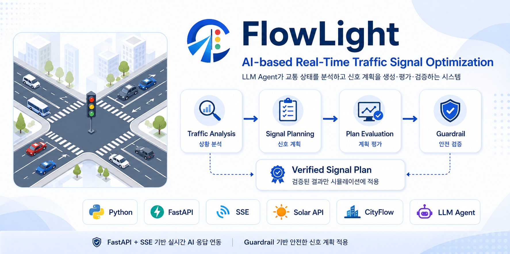
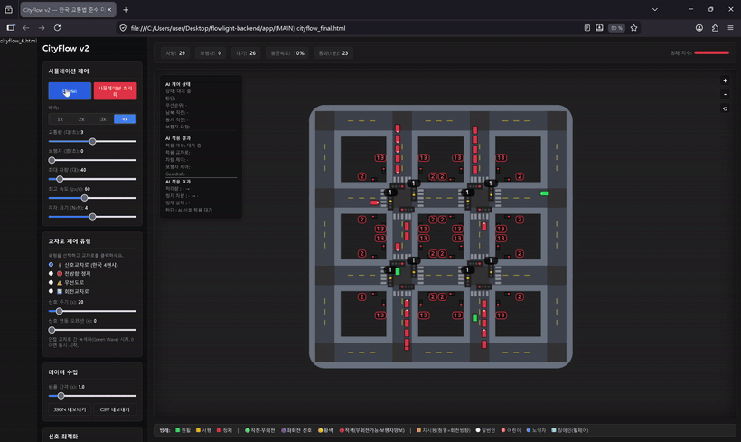
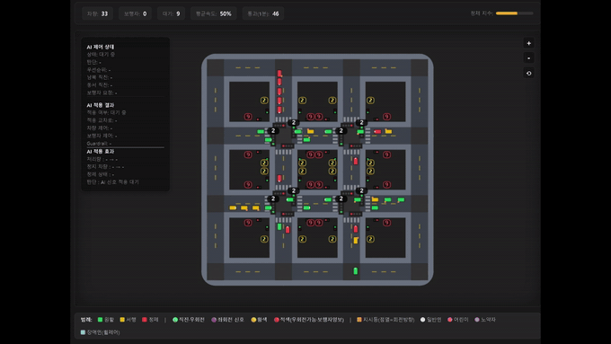
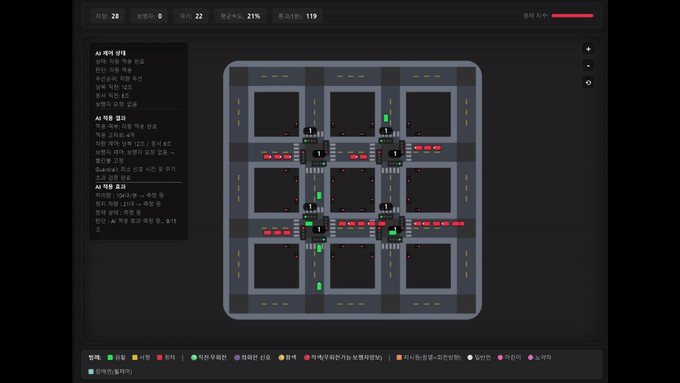
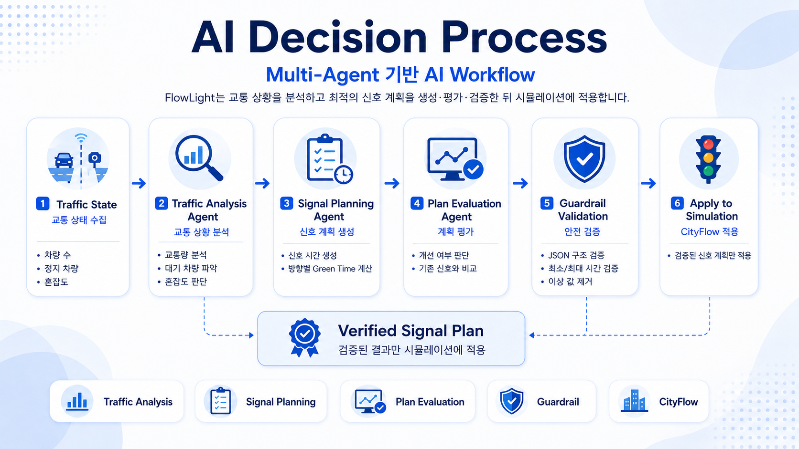
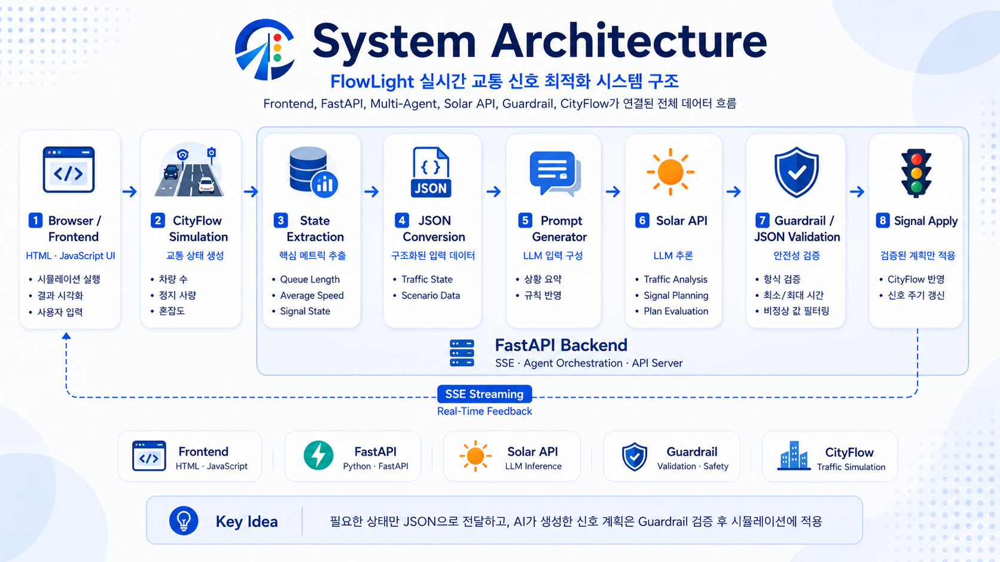
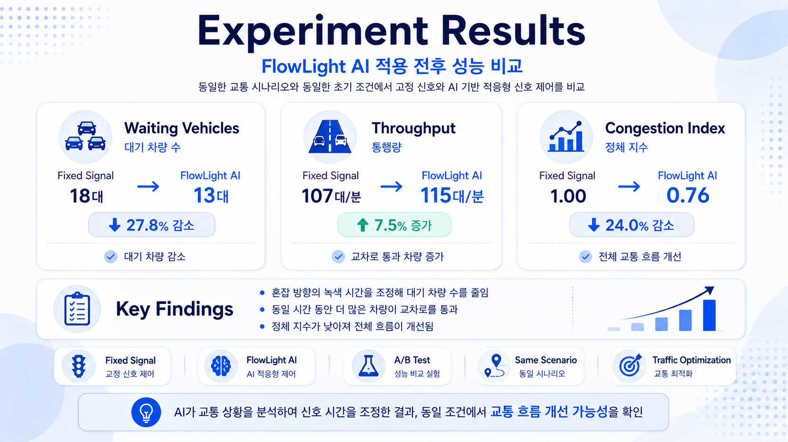

# 🚦 FlowLight

<p align="center">
  
</p>

<div align="center">

# AI-based Real-Time Traffic Signal Optimization

### LLM 기반 Multi-Agent를 활용한 실시간 교통 신호 최적화 시스템

**FastAPI · SSE · Solar API · Guardrail · CityFlow**

</div>

---

## 🎬 Live Demo

FlowLight의 전체 시뮬레이션 실행 화면입니다.

<p align="center">
  
</p>

---

## 📊 AI Performance Comparison

동일한 조건에서 **AI 미적용 고정 신호**와 **FlowLight AI 적용 신호**를 비교했습니다.

| Before AI | After AI |
|----------|---------|
|  |  |

> AI가 교통 상황을 분석하여 신호 시간을 조정하고, 검증된 신호 계획만 시뮬레이션에 적용합니다.

---

## 📖 Project Overview

FlowLight는 **LLM 기반 Multi-Agent**를 활용하여 교차로의 실시간 교통 상황을 분석하고,
최적의 신호 시간을 생성하는 **AI 기반 교통 신호 최적화 시스템**입니다.

기존의 고정 신호 방식과 달리, AI Agent가 교통량과 대기 차량 수를 분석하여
상황에 맞는 신호 계획을 생성합니다.

생성된 신호 계획은 Guardrail을 통해 검증된 후 시뮬레이션에 적용되며,
FastAPI와 SSE(Server-Sent Events)를 이용하여 AI의 의사결정 과정을
실시간으로 확인할 수 있도록 구현했습니다.

---

## ✨ Key Features

- 🚦 **Real-Time Traffic Analysis**
  - 교통 상태를 실시간으로 분석하여 현재 상황을 파악

- 🤖 **LLM Multi-Agent Decision Making**
  - Traffic Analysis, Signal Planning, Plan Evaluation Agent를 통해 최적 신호 생성

- 🛡 **Guardrail Validation**
  - 비정상적인 신호 계획을 검증하고 안전한 결과만 적용

- ⚡ **Real-Time Streaming**
  - FastAPI와 SSE를 활용하여 AI 의사결정 과정을 실시간 표시

- 📊 **Traffic Simulation**
  - CityFlow 시뮬레이션과 연동하여 AI 적용 효과 검증

---

 ## 🤖 AI Decision Process

FlowLight는 **Multi-Agent 기반 AI Workflow**를 통해 교통 상황을 분석하고 최적의 신호 계획을 생성합니다.

<p align="center">
  
</p>

### AI Workflow

### Workflow Summary

| Agent | Responsibility |
|--------|----------------|
| 🔍 Traffic Analysis | 교통량 및 혼잡도 분석 |
| 📝 Signal Planning | 최적 신호 시간 생성 |
| 📊 Plan Evaluation | 기존 계획과 비교 평가 |
| 🛡 Guardrail | JSON 및 신호 시간 검증 |
| 🚦 Apply | 검증된 계획만 CityFlow 적용 |

---

## 🏗 System Architecture

FlowLight는 **Frontend → FastAPI → Multi-Agent → Guardrail → CityFlow**로 이어지는 구조를 사용합니다.

<p align="center">
  
</p>

### Architecture Summary

| Layer | Description |
|-------|-------------|
| 🖥 Frontend | HTML/JavaScript 기반 시뮬레이션 UI |
| 🚗 CityFlow | 교통 상태 생성 및 시뮬레이션 실행 |
| ⚙ FastAPI | API Server 및 Agent Orchestration |
| 🤖 Solar API | LLM 기반 교통 분석 및 신호 계획 생성 |
| 🛡 Guardrail | JSON 및 신호 시간 검증 |
| 🚦 Simulation | 검증된 신호 계획만 적용 |

---

# 📊 Experiment Results

FlowLight는 **동일한 교통 시나리오와 동일한 초기 조건**에서
기존 **고정 신호 제어(Fixed Signal)** 와
**AI 기반 적응형 신호 제어**의 성능을 비교했습니다.

<p align="center">
  
</p>

### Performance Summary

| Metric | Fixed Signal | FlowLight AI | Improvement |
|:--------|-------------:|-------------:|------------:|
| 🚗 Waiting Vehicles | **18** | **13** | **⬇ 27.8%** |
| 🚦 Throughput | **107** | **115** | **⬆ 7.5%** |
| 📈 Congestion Index | **1.00** | **0.76** | **⬇ 24.0%** |

> 동일한 시나리오와 동일한 초기 조건에서 비교를 수행하여 AI 기반 신호 제어의 개선 효과를 확인했습니다.

---

## ⚙ Tech Stack

### Core Technologies

<p>
  
  
  
  
  
</p>

### Technology Overview

| Category | Stack | Role |
|---------|-------|------|
| **Backend** | Python, FastAPI | AI Agent 호출 및 API 서버 구현 |
| **AI / LLM** | Upstage Solar API, Prompt Engineering | 교통 상황 분석 및 신호 계획 생성 |
| **Streaming** | SSE(Server-Sent Events) | AI 분석 과정과 결과를 실시간 전달 |
| **Frontend** | HTML, JavaScript | 시뮬레이션 실행 및 결과 시각화 |
| **Simulation** | CityFlow 기반 시뮬레이션 | 교통 상태 생성 및 AI 적용 효과 비교 |
| **Reliability** | Guardrail, JSON Validation | 비정상 응답 필터링 및 안전한 신호 계획 적용 |

---

## 👨‍💻 My Contributions

본 프로젝트에서 저는 **LLM Agent 설계, Backend 연동, Guardrail 검증, Frontend 연결, 실험 및 발표 자료 제작**을 중심으로 수행했습니다.

### AI / LLM

- Traffic Analysis Agent, Signal Planning Agent, Plan Evaluation Agent 구조 설계
- Upstage Solar API 기반 LLM 호출 흐름 구현
- 교통 상태 데이터를 LLM 입력에 적합한 Prompt 형식으로 변환
- JSON 기반 신호 계획 출력 형식 설계

### Backend

- FastAPI 기반 AI Agent 서버 구현
- Frontend와 통신하기 위한 API Endpoint 구성
- SSE(Server-Sent Events)를 활용한 실시간 스트리밍 응답 구현
- AI 분석 단계, 신호 계획 생성, 평가 결과를 순차적으로 전달하는 흐름 구성

### Reliability

- Guardrail을 통한 신호 시간 최소/최대 범위 검증
- JSON 응답 형식 검증
- 비정상 값 필터링 및 안전한 신호 계획만 적용하도록 처리
- 오류 발생 시 데모가 중단되지 않도록 예외 처리 보완

### Frontend / Demo

- HTML / JavaScript 기반 시뮬레이션 화면과 Backend 연동
- AI 분석 결과 및 신호 계획을 사용자 화면에 표시
- AI 적용 전 / 후 비교 시나리오 구성
- 전체 시뮬레이션 데모 영상 제작

### Documentation / Presentation

- 프로젝트 발표 자료 제작
- 시스템 아키텍처 및 AI 의사결정 과정 정리
- 실험 결과 분석 및 발표
- 최종 발표 진행
---

## 📂 Project Structure

```text
FlowLight-AI-Traffic-Signal
├── README.md
├── README_v2.md
├── requirements.txt
├── .gitignore
│
├── app/
│   ├── main.py
│   ├── agents.py
│   └── ...
│
├── docs/
│   ├── flowlight_banner.png
│   ├── ai_decision_process.png
│   ├── system_architecture.png
│   ├── experiment_results.png
│   ├── flowlight_live_demo.gif
│   ├── flowlight_before_ai.gif
│   ├── flowlight_after_ai.gif
│   └── FlowLight_Final_Presentation.pdf
│
└── tests/
```

### Directory Description

| Path | Description |
|------|-------------|
| `app/` | FastAPI 기반 AI Agent 서버 및 주요 로직 |
| `docs/` | README 이미지, GIF, 발표 자료 등 문서 리소스 |
| `tests/` | 테스트 코드 |
| `requirements.txt` | Python 패키지 의존성 목록 |
| `README_v2.md` | 포트폴리오용 README 작업 버전 |

---

## 📄 Presentation

프로젝트의 문제 정의, AI Agent 설계, 시스템 아키텍처, 실험 결과, 회고 내용을 발표 자료로 정리했습니다.

[📑 View Final Presentation](docs/FlowLight_Final_Presentation.pdf)

### Presentation Contents

| Section | Description |
|--------|-------------|
| Problem | 고정형 교통 신호 체계의 한계 |
| Method | LLM Agent 기반 분석·계획·평가 구조 |
| Architecture | FastAPI, SSE, Solar API, Guardrail 기반 시스템 구성 |
| Experiment | AI 적용 전후 교통 흐름 비교 |
| Retrospective | 프로젝트를 통해 배운 점과 향후 개선 방향 |

---

## 🚀 Future Work

FlowLight는 현재 시뮬레이션 기반 MVP로 구현되었으며, 향후 실제 교통 데이터와 더 복잡한 도로 환경으로 확장할 수 있습니다.

| Improvement Area | Description |
|------------------|-------------|
| **Real Traffic Data** | 공공 교통 API, CCTV, 센서 데이터와 연동하여 실제 교통 상황 반영 |
| **Roundabout Scenario** | 회전교차로 차량 흐름과 우선순위 규칙 추가 |
| **Multi-Intersection Control** | 인접 교차로 간 신호 연동 및 녹색파 제어 확장 |
| **Reinforcement Learning** | LLM Agent와 강화학습을 결합한 하이브리드 신호 최적화 |
| **Evaluation Automation** | 평균 속도, 대기 차량 수, 통행량 등 성능 지표 자동 수집 및 분석 |

---

## 📝 Lessons Learned

이번 프로젝트를 통해 단순히 LLM API를 호출하는 것보다,  
AI 결과를 **평가하고 검증한 뒤 서비스 흐름에 안전하게 연결하는 과정**이 더 중요하다는 점을 배웠습니다.

### Key Takeaways

- LLM을 단순 질의응답이 아니라 **Agent 기반 의사결정 구조**로 설계하는 방법을 경험했습니다.
- Prompt Engineering을 통해 AI가 **정해진 입력과 출력 형식**을 따르도록 설계했습니다.
- FastAPI와 SSE를 활용하여 AI의 분석 과정과 결과를 **실시간으로 사용자 화면에 전달**했습니다.
- Guardrail과 JSON Validation을 통해 AI가 생성한 결과를 **그대로 적용하지 않고 검증 후 적용**하는 구조를 구현했습니다.
- 실험 결과를 수치와 영상으로 함께 제시하는 것이 프로젝트 설득력에 중요하다는 점을 확인했습니다.
