# 🚦 FlowLight

<p align="center">
  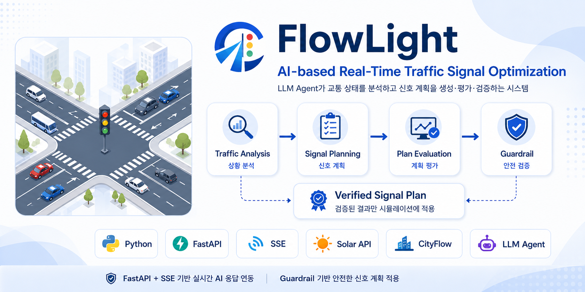
</p>

<div align="center">

# AI-based Real-Time Traffic Signal Optimization

### Upstage Solar Pro 4 기반 Multi-Agent 실시간 교통 신호 최적화 데모

**FastAPI · SSE · Solar Pro 4 · Structured Outputs · Guardrail · Traffic Simulator**

**한국어** · [English](README.en.md)

</div>

---

## 🎬 Live Demo

사용법 안내 → 실데이터 프로파일 → AI 분석 → 신호 적용까지의 실행 화면입니다.

<p align="center">
  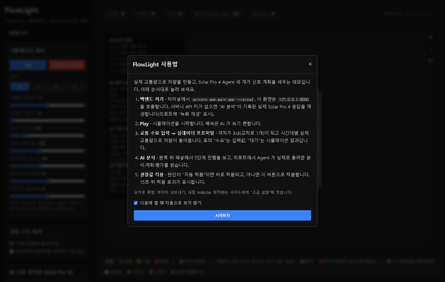
</p>

---

# 📌 프로젝트 소개

FlowLight는 고정 시간 신호 대신 **LLM Agent 세 개**가 교통 상황을 분석하고 신호 시간을 계획한 뒤 스스로 평가하는 구조입니다.
출발점은 두 가지였습니다. **횡단보도에 사람이 없으면 보행 신호를 건너뛰어 차량을 흐르게 하고, 어린이·노약자·휠체어 이용자가 건너면 보행 시간을 늘려 주자.**
LLM 출력은 **Structured Outputs(JSON Schema)** 로 형식이 강제되고, **Guardrail**(규칙 기반 안전 장치)을 거친 뒤에만 시뮬레이터에 적용되며,
FastAPI + SSE(Server-Sent Events)로 AI의 의사결정 과정을 단계별로 실시간 확인할 수 있습니다.

이 저장소는 Upstage 공식 Demo/튜토리얼로 발전시키는 중이며, 다음 원칙을 따릅니다.

- 실제 **시간당 교통량(volume)** 을 **차량 발생률(arrival rate)** 로 변환해 시뮬레이터에 차량을 만들고, **대기 차량 수(queue)** 는 시뮬레이터가 계산합니다.
  842대/시라는 교통량을 대기 차량 842대로 취급하지 않습니다.
- LLM의 내부 추론(reasoning)은 사용하지 않으며, 화면에는 Agent가 **명시적으로 반환한** `summary` / `explanation` / `reason` 만 보여 줍니다.

---

## 📊 AI 적용 전후 비교

같은 시드로 같은 상태를 만든 뒤, **고정 신호**와 **Solar Pro 4 가 세운 계획**을 각각 60초씩 돌린 영상입니다(GIF 는 2초 간격). 두 실행의 차이는 신호뿐입니다.

| Before AI (고정 신호) | After AI (남북 12초 / 동서 8초 / 보행자 0초) |
|----------|---------|
| 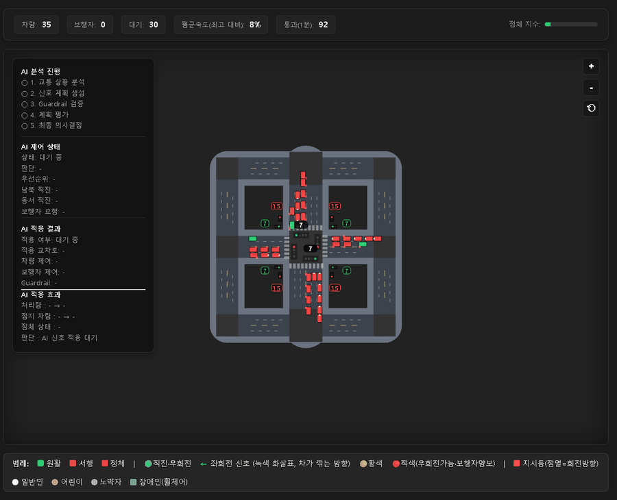 | 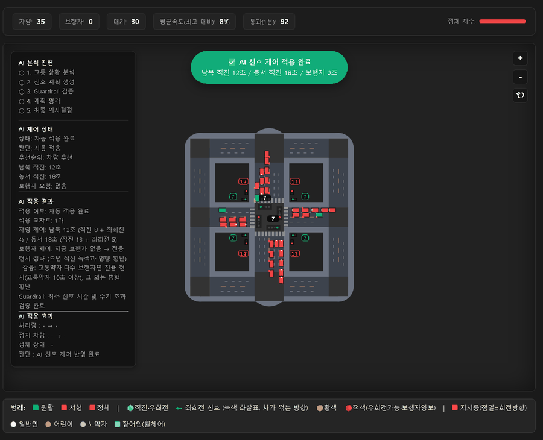 |

| 지표 (60초 창) | 고정 신호 | FlowLight AI | 변화 |
|:--------|-------------:|-------------:|------------:|
| 🚦 통과 차량 (최근 1분, 60초 후) | **121대** | **131대** | **⬆ 8.3%** |
| 🚗 정지 차량 (60초 평균) | **33.9대** | **31.3대** | **⬇ 7.7%** |
| 📈 정체 지수 (60초 평균) | **0.91** | **0.92** | 변화 없음 |

- 조건: 수동 모드 4x4 격자, 교통량 5대/초, 시드 20260702, 워밍업 120초 시점에 차량 49대·정지 33대·정체 지수 0.94. 포화 상태라 정체 지수는 양쪽 다 0.9 대에 머뭅니다.
- 이 상태를 실제 Solar Pro 4 에 보낸 결과: Agent 1 주요 혼잡 방향 "남북", 계획 남북 12초 / 동서 8초 / 보행자 0초, Guardrail 보정 없음, 평가 88점, 최종 판단 `자동 적용`.
- 적용은 실제 신호 체계대로 했습니다. 방향별 녹색을 직진 70%·좌회전 30% 로 나눠 4현시를 유지하고, 남북 방향 녹색파(교차로 간 1.7초 시차)를 걸고, 매 주기 좌회전·보행 대기를 보고 현시를 넣거나 뺐습니다. 이렇게 하면 단순 2현시로 적용할 때보다 이득이 줄지만(그때는 정지 34 → 21대), 실제 교차로에 가까운 결과입니다.
- 수동 모드에서 계획을 적용하면 유입을 120초 동안 절반으로 줄이는 완화 로직이 있는데, 비교가 공정하도록 적용 직후 해제하고 두 실행에 같은 수요를 넣었습니다.
- 방법은 고급 설정의 A/B 검증과 같습니다. 같은 시드, 고정 스텝(1/30초), 같은 워밍업 뒤 분기.

---

# 🏗 시스템 구조

FlowLight는 **교통 데이터 → 시뮬레이터 → FastAPI → Multi-Agent → Guardrail → 시뮬레이터 적용**으로 이어지는 구조입니다.

<p align="center">
  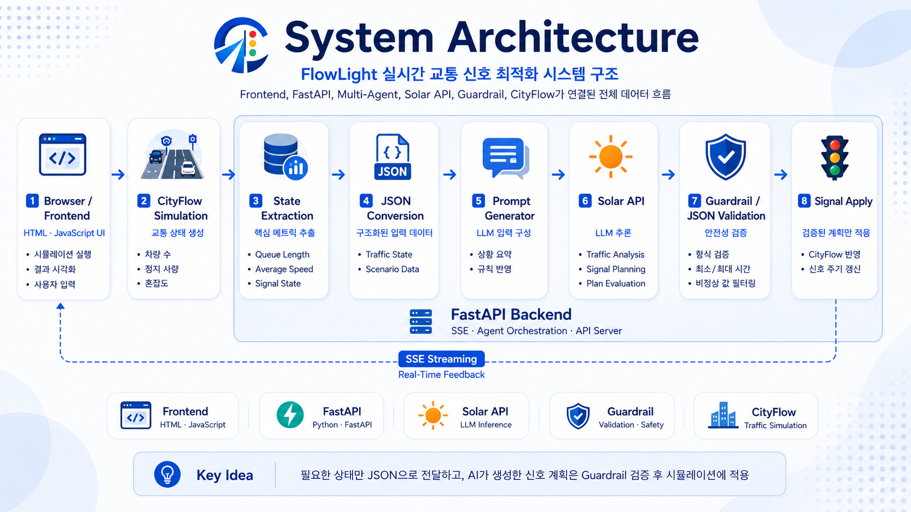
</p>

> 배너와 위 구조도의 "CityFlow" 는 이 저장소의 자체 시뮬레이터(`app/index.html`)를 뜻하고, "Solar API" 는 현재 Solar Pro 4 입니다. 그림은 초기 버전 기준입니다.

교통량 데이터가 Agent 까지 흘러가는 경로는 다음과 같습니다. 교통량(대/시)은 발생률로만 바뀌고, 대기 차량 수는 시뮬레이터가 계산합니다.

<p align="center">
  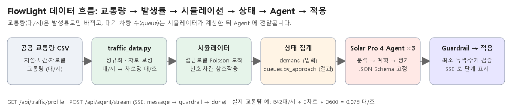
</p>

```
공공 교통량 CSV ─(app/traffic_data.py: 정규화·차로 보정·대/시 → 대/초)─▶ 수요 프로파일
   ─(GET /api/traffic/profile)─▶ 브라우저 시뮬레이터 (3x3 교차로, 접근로별 Poisson 도착)
   ─(접근로별 queue·대기시간·도착·포화도 집계)─▶ scenario JSON (demand + queues.by_approach)
   ─(POST /api/agent/stream, SSE)─▶ Agent 1 분석 → Agent 2 계획 → Guardrail → Agent 3 평가 → 최종 판단
   ─▶ 화면 표시 및 신호 적용
```

| Layer | Description |
|-------|-------------|
| 📈 Traffic Data | 공공 교통량 CSV 를 접근로별 수요 프로파일로 정규화하고 차량 발생률로 변환 |
| 🖥 Frontend | HTML/JavaScript 시뮬레이터. 수요 프로파일로 차량 생성, 상태 집계, 결과 시각화 |
| ⚙ FastAPI | API 서버, Agent 오케스트레이션, SSE 스트리밍, 수요 프로파일 제공 |
| 🤖 Solar Pro 4 | LLM 기반 교통 분석·신호 계획·평가 (Structured Outputs) |
| 🛡 Guardrail | 최소 녹색 시간·주기 검증, 최종 판단 보정 |
| 🚦 Simulation | 검증된 신호 계획만 적용 |

## 세 가지 값의 구분

| 값 | 의미 | 어디서 나오나 |
|---|---|---|
| `volume_per_hour` | 실제 입력 수요 (대/시) | 공공 데이터 |
| `arrival_rate_per_sec` | 시뮬레이터 차량 발생률 (차로당 대/초) = `volume / lanes / 3600` | 백엔드 `traffic_data.py` |
| `queue` | 현재 대기 차량 수 | **시뮬레이션 결과** (신호·차간 상호작용) |

---

# 🤖 AI 의사결정 과정

FlowLight는 **Multi-Agent 기반 AI Workflow**로 교통 상황을 분석하고 신호 계획을 생성한 뒤 스스로 평가합니다. Guardrail 은 계획 직후, 평가 이전에 실행됩니다.

<p align="center">
  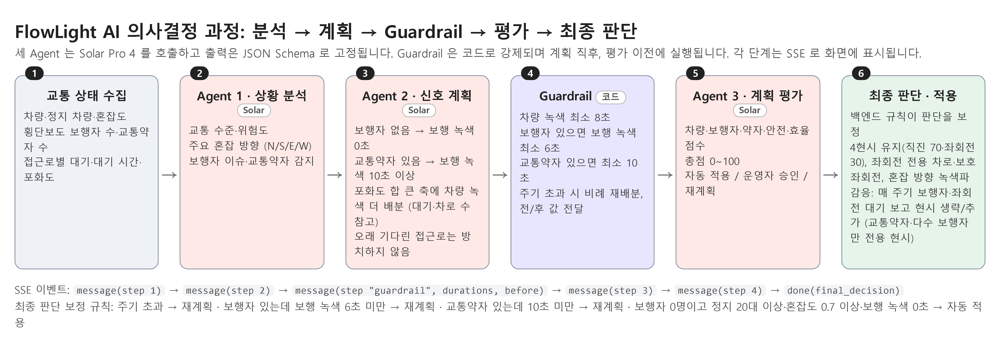
</p>

| 단계 | 역할 |
|------|------|
| 🔍 Traffic Situation Agent | 교통 수준·위험도·주요 혼잡 방향 판단 |
| 📝 Signal Planning Agent | 남북/동서/보행자 녹색 시간 계획 |
| 🛡 Guardrail | 최소 녹색 시간과 주기 검증, 보정 전/후 전달 |
| 📊 Plan Evaluation Agent | 점수화와 자동 적용 / 운영자 승인 / 재계획 판단 |
| 🚦 Apply | 검증된 계획만 시뮬레이터에 적용 |

## 🚗 Traffic Situation Agent (Agent 1)
- 차량 수·정지 차량·혼잡도·보행자 수로 교통 수준과 위험도를 판단
- `queues.by_approach` 가 있으면 접근로별 대기·포화도로 **주요 혼잡 방향**(N/S/E/W, 남북/동서)을 판정
- 출력: `summary`, `traffic_level`, `main_congestion_direction`, `pedestrian_issue`, `vulnerable_user_detected`, `risk_level`

## 🤖 Signal Planning Agent (Agent 2)
- 남북/동서 차량 녹색 시간과 보행자 녹색 시간을 정수 초로 계획
- 보행자가 0명이면 보행 녹색 0초. 어린이·노약자·휠체어 이용자(`vulnerable_count`)가 있으면 보행 녹색 10초 이상
- 접근로별 상태가 있으면 대기·포화도가 큰 축에 녹색을 더 배분하고, 어느 접근로의 평균 대기 시간이 주기의 2배를 넘으면 차량이 적어도 그 축을 방치하지 않음. 근거 수치를 `explanation` 에 명시
- 출력: `durations`(3개 정수), `priority`(VEHICLE / PEDESTRIAN / BALANCED), `next_signals`, `explanation`

## ✅ Plan Evaluation Agent (Agent 3)
- 차량·보행자·교통약자·안전·효율 점수와 총점(0~100)
- 판단: `자동 적용` / `운영자 승인 필요` / `재계획 필요` (Schema enum 으로 고정)
- 출력: `total_score`, `scores`, `decision_recommendation`, `reason`

## 🛡 Guardrail (규칙 기반, 코드로 강제)
- 차량 녹색 최소 8초
- 보행 녹색: 보행자 없음 0초 / 있음 최소 6초 / 교통약자 있음 최소 10초
- 합계가 주기(`cycle_sec`)를 넘으면 차량 시간만 비례 재배분
- 백엔드가 보정 전/후 값을 함께 보내 화면에 "보정됨: 14/6/0 → 12/8/0" 형태로 표시

## 🧭 최종 판단 보정 (백엔드)
LLM 판단을 다음 규칙이 덮어씁니다. 프롬프트의 자동 적용 선결 조건과 동일합니다.
1. 신호 합계가 주기 초과 → `재계획 필요`
2. 보행자가 있는데 보행 녹색 6초 미만 → `재계획 필요`
3. 교통약자가 있는데 보행 녹색 10초 미만 → `재계획 필요`
4. 보행자 0명 · 정지 차량 20대 이상 · 혼잡도 0.7 이상 · 보행 녹색 0초 → `자동 적용`

## 🚦 계획은 실제 신호 체계대로 적용됩니다
AI 계획(남북 N초 / 동서 M초 / 보행 P초)은 예산이고, 시뮬레이터가 실제 교차로 운영 방식으로 풀어냅니다.
- **한국식 4현시 유지**: 방향별 녹색을 직진 70% / 좌회전 30% 로 나눕니다. 좌회전 등은 4색 신호등의 녹색 화살표이고, 차로가 하나뿐이라 보호·비보호 겸용 좌회전(직진 녹색 때 비보호, 화살표 때 보호)을 씁니다.
- **녹색파 연동**: Agent 1 이 짚은 주요 혼잡 방향으로 교차로 시작 시점을 어긋나게 둡니다. 시차 = 교차로 간 거리 ÷ 최고 속도. 교차로가 1개면 없습니다.
- **감응 신호 (AI 적용 후에만)**: 주기가 돌 때마다 교차로별로 현장을 봅니다.
  - 횡단보도에 아무도 없으면 그 주기의 보행 현시를 생략해 차량에 다 줍니다. 있으면 계획 길이(최소 6초), 어린이·노약자·휠체어가 있으면 최소 10초로 켭니다. 계획이 0초였어도 사람이 오면 켭니다.
  - 좌회전 대기가 두 대 이상 쌓이면 좌회전 현시를 넣고, 선두 차가 좌회전이라 뒤가 막혀 있으면 좌회전을 먼저 켭니다(선행 좌회전). 대기가 없으면 좌회전 현시를 생략합니다.
- **보행 전용 현시**: 보행 녹색은 모든 차량이 멈추고 모든 횡단보도가 녹색이 되는 현시입니다. 보행 신호 중 우회전은 금지, 적색 우회전은 보행자에게 양보 후 진행합니다.

AI 적용 전의 기본 신호는 고정 시간표(4현시, 교차 방향 차량 녹색과 나란히 보행 녹색)입니다.

## 📡 SSE 실시간 스트리밍
`POST /api/agent/stream` 은 다음 이벤트를 순서대로 보냅니다.

| event | data |
|---|---|
| `message` | `{step: 1..4, message}` 단계 진행 |
| `message` | `{step: "guardrail", durations, before}` Guardrail 결과 |
| `done` | `{input_state, traffic_analysis, signal_plan, evaluation, final_decision}` |
| `error` | `{status: "error", agent, message, detail}` (이후 스트림 종료) |

## 🖥 시뮬레이터 (브라우저)
- 한국식 4현시 신호, 좌회전 현시, 황색·전적색, 보행자 4유형과 횡단보도 양보, 4가지 교차로 제어, 녹색파 오프셋
- **교통 수요 입력 모드**
  - 수동: 교통량 슬라이더(네트워크 전체 대/초)로 무작위 진입로에 차량 생성
  - 실데이터 프로파일: 백엔드 프로파일의 접근로별 발생률로 3x3 교차로의 N/S/E/W 진입로에 Poisson 도착 생성, 시간대 선택·자동 진행, 접근로별 수요·발생률·진입·손실·대기 표
- AI 계획은 4현시 유지·녹색파·감응 신호로 적용(위 절 참고). 적용 후 효과는 시뮬레이션 시간 15초 평균으로 측정하므로 배속을 걸면 그만큼 빨리 나옴
- AI 분석 진행 패널(5단계, 단계별 소요 시간), Agent 실제 출력 표시, Guardrail 보정 전후 표시
- 처음 열면 다섯 단계 사용법 안내가 뜨고, 사이드바의 "사용법 보기"로 다시 열 수 있음
- 교차로 유형, 데이터 내보내기, Webster 기반 로컬 최적화기와 시드 고정 A/B 검증(LLM 과 무관)은 "고급 설정" 접기에 정리

---

# 📊 실험 결과

AI 적용 전후 비교는 위의 [AI 적용 전후 비교](#-ai-적용-전후-비교) 절에 있습니다.

<details>
<summary>이전 버전(Solar Pro 3, 2026-07) 실험 결과</summary>

같은 방식으로 이전 버전에서 측정한 결과입니다. 대기 차량 18대 → 13대(27.8% 감소), 통과 107 → 115대/분(7.5% 증가), 정체 지수 1.00 → 0.76(24.0% 감소).

<p align="center">
  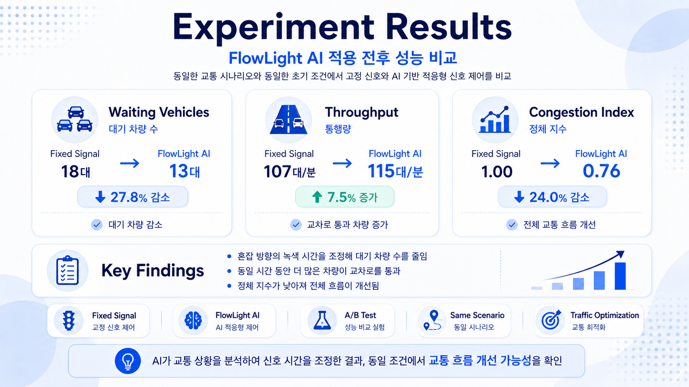
</p>
</details>

## 실제 API 검증 기록 (solar-pro4-260806, 2026-09-10)

| 조건 | 결과 |
|---|---|
| 기존 입력, `json_object` | 3회 모두 200·`stop`, 12/8/0, 88점, 자동 적용, 전체 15.4초 |
| 기존 입력, `json_schema` | 3회 모두 200·`stop`, Schema 준수, 동일 결과, 전체 15.1초 |
| 접근로별 상태 포함 입력, `json_schema` | 주요 혼잡 방향 "남북", 계획 14/6/0 → Guardrail 이 12/8/0 으로 보정, 88점, 자동 적용, 전체 24.6초 |
| 프로파일 모드 화면에서 실행 (차량 9대, 북측 대기 2대·포화도 1.2) | 주요 혼잡 방향 "N", 계획 12/8/0, 82점, 운영자 승인 필요 → 수동 적용 후 정체 지수 0.61 → 0.35 (단순 2현시 적용 시절 측정) |
| 수동 모드 4x4, 차량 49대·정지 33대 (전후 비교 GIF 의 분기 상태) | 주요 혼잡 방향 "남북", 계획 12/8/0, Guardrail 보정 없음, 88점, 자동 적용 → 실제 신호 체계로 적용해 60초 후 통과 121 → 131대 |
| 수동 모드 4x4, 주기 30초, 차량 18대, 횡단보도에 보행자 2명(노약자 1명 포함) | Agent 1 교통약자 감지, 계획 12/8/10 ("교통약자 1명이 있어 횡단 속도를 고려해 10초"), Guardrail 보정 없음, 82점, 운영자 승인 필요 → 적용 후 보행 전용 현시 10초 |

reasoning 은 켜지 않았습니다(`reasoning_effort` 미전송, reasoning 토큰 0). 응답 시간은 네트워크 상태에 따라 달라집니다.
Guardrail 이 실제 Solar Pro 4 계획을 고친 사례는 다음과 같습니다.

<p align="center">
  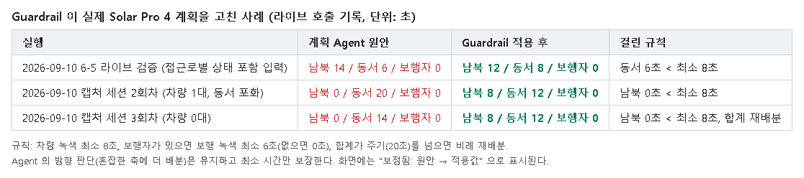
</p>

---

# 🛠 기술 스택

<p>
  
  
  
  
</p>

| 영역 | 내용 |
|---|---|
| Backend | Python 3.10+, FastAPI, uvicorn |
| AI | Upstage Solar Pro 4 (`solar-pro4`), OpenAI 호환 SDK, Structured Outputs |
| Frontend | 단일 HTML + Canvas + JavaScript, SSE 수동 파싱 |
| Data | 표준 라이브러리만 사용한 CSV 정규화 계층 |
| Test | pytest, httpx (Solar 호출은 기본적으로 mock) |

---

# 📂 프로젝트 구조

```text
FlowLight-AI-Traffic-Signal
├── app
│   ├── main.py                     # FastAPI: SSE 파이프라인, 최종 판단 보정, 프로파일 엔드포인트
│   ├── agents.py                   # Solar 클라이언트, 프롬프트 3개, JSON Schema 3개, Guardrail
│   ├── traffic_data.py             # 공공 교통량 CSV → 정규화 프로파일 → 발생률
│   └── index.html                  # 시뮬레이터 + UI + 백엔드 연동 (브라우저로 여는 파일)
├── data
│   ├── README.md                   # 데이터 출처, 컬럼 매핑, 합성 예제 공식, 교체 절차
│   ├── sample_seoul_traffic_history.csv
│   └── sample_seoul_traffic_history.meta.json
├── tests                           # 215개 (mock 214 + live 1, live 는 opt-in)
├── docs
│   ├── screens/                    # 현재 UI 화면 (사용법, 메인, 프로파일 모드, 진행 패널, 리포트, 적용, 보행 전용 현시, 고급 설정)
│   ├── flowlight_banner.png, flowlight_live_demo.gif
│   ├── system_architecture.png, data_flow.png, ai_decision_process.png, guardrail_cases.png
│   ├── flowlight_before_ai.gif, flowlight_after_ai.gif, experiment_results.png   # 이전 버전 실험
│   └── FlowLight_Final_Presentation.pdf
├── LICENSE                         # MIT
├── .env.example
├── pytest.ini
├── requirements.txt
├── README.md                       # 한국어
└── README.en.md                    # English
```

---

# 🚀 실행 방법

### 1. 저장소 Clone

```bash
git clone https://github.com/jihooni217/FlowLight-AI-Traffic-Signal.git
```

### 2. 라이브러리 설치 (Python 3.10 이상)

```bash
pip install -r requirements.txt
```

### 3. 환경 변수 설정

`.env.example` 을 `.env` 로 복사하고 키를 넣습니다. `.env` 는 커밋되지 않습니다.

| 변수 | 기본값 | 설명 |
|---|---|---|
| `UPSTAGE_API_KEY` | (필수) | Upstage 콘솔에서 발급 |
| `UPSTAGE_MODEL` | `solar-pro4` | `solar-pro3` 로 롤백하거나 `solar-pro4-260806` 로 스냅샷 고정 가능 |
| `UPSTAGE_OUTPUT_MODE` | `json_schema` | Structured Outputs. 문제 시 `json_object` 로 폴백 |
| `TRAFFIC_PROFILE_META` | `data/sample_seoul_traffic_history.meta.json` | 다른 교통량 프로파일 메타 파일 경로 |

### 4. 서버 실행

```bash
uvicorn app.main:app --reload
```

서버는 `http://127.0.0.1:8000` 에 뜹니다. `GET /` 로 상태를 확인할 수 있습니다.

### 5. 프론트엔드 열기

`app/index.html` 파일을 브라우저에서 직접 엽니다. 프론트는 `http://127.0.0.1:8000` 의 백엔드를 호출하며, CORS 는 열려 있습니다.

### 6. 데모 진행

1. 처음 열면 다섯 단계 **사용법 안내** 가 뜹니다. 읽고 "시작하기"를 누릅니다. 사이드바의 "사용법 보기"로 다시 볼 수 있습니다.
2. **Play** 로 시뮬레이션을 시작합니다. 배속은 4x 가 보기 편합니다.
3. 사이드바 **교통 수요 입력** 에서 *실데이터 프로파일* 을 선택하면 격자가 3x3 으로 바뀌고, 시간대(0~23시)별 접근로 수요로 차량이 생성됩니다. 기본은 08시 첨두입니다.
4. **AI 분석** 을 누르면 좌측 패널에 5단계 진행 상태가 표시되고, 리포트에 Agent 별 실제 출력·Guardrail 보정·평가 근거가 나타납니다.
5. 최종 판단이 `자동 적용` 이면 신호가 자동 적용되고, 그 외에는 **권장값 적용** 으로 수동 적용할 수 있습니다. 시뮬레이션 15초 뒤 적용 전후 효과가 표시됩니다.
6. 보행자 쪽을 보려면 사이드바 **보행자(명/초)** 슬라이더를 1 로 올립니다. 횡단보도에 어린이·노약자·휠체어 이용자가 서 있을 때 분석하면 보행 녹색이 10초 이상으로 잡히고, 적용 후 모든 차가 멈추는 보행 전용 현시가 보입니다. 보행자가 없으면 0초로 잡혀 보행 현시가 사라집니다.

---

# 🔌 API

| 메서드·경로 | 설명 |
|---|---|
| `GET /` | 헬스 체크 |
| `GET /api/traffic/profile` | 정규화된 수요 프로파일. `meta`, `available_hours`, `hours[{hour, volume, arrival_rate_per_sec}]`. `?hour=8` 로 한 시간대만 조회 (범위 밖 400, 없는 시간 404) |
| `POST /api/agent/stream` | 시뮬레이션 상태 JSON → SSE 로 Agent 파이프라인 진행·결과 |
| `GET /api/agent/stream` | 내장 mock 상태로 같은 파이프라인 실행 (테스트용) |

## 입력 상태(scenario) 형식

프론트가 보내는 JSON 입니다. 기존 필드만 있어도 동작하며, `demand` 와 `queues.by_approach` 는 프로파일·격자 조건에 따라 추가됩니다.

```json
{
  "intersection_id": "simulation-current",
  "tick": 412,
  "signals": {"cycle_sec": 20},
  "queues": {
    "total_cars": 28, "stopped_cars": 19,
    "by_approach": {
      "N": {"queue": 9, "mean_wait_sec": 14.2, "arrivals_last_window": 31, "saturation": 0.83},
      "S": {"queue": 7, "mean_wait_sec": 11.0, "arrivals_last_window": 28, "saturation": 0.75},
      "E": {"queue": 2, "mean_wait_sec": 3.1,  "arrivals_last_window": 12, "saturation": 0.31},
      "W": {"queue": 1, "mean_wait_sec": 2.4,  "arrivals_last_window": 10, "saturation": 0.27}
    }
  },
  "pedestrians": {"waiting_or_crossing": 0, "vulnerable_count": 0},
  "context": {"source": "flowlight_index_html", "grid_size": 3, "demand_mode": "profile",
              "by_approach_scope": "intersection_approaches", "window_sec": 30},
  "metrics": {"congestion": 0.894, "throughput_per_min": 125},
  "demand": {
    "mode": "profile", "site_id": "DEMO-X", "hour": 8, "unit": "veh_per_hour",
    "volume_per_hour": {"N": 842, "S": 790, "E": 610, "W": 655},
    "lanes": {"N": 3, "S": 3, "E": 2, "W": 2},
    "arrival_rate_per_sec": {"N": 0.077963, "S": 0.073148, "E": 0.084722, "W": 0.090972},
    "lost_demand_last_60s": {"N": 0, "S": 0, "E": 0, "W": 0}
  }
}
```

- `demand` 는 입력이고 `queues` 는 결과입니다. 프롬프트가 이 구분을 명시하며, `demand` 블록에는 `queue` 키가 존재하지 않습니다.
- 접근로 명명: `N` 은 **북측에서 진입해 남쪽으로 향하는** 차량입니다.

---

# 🧪 테스트

```bash
python -m pytest -q
```

- 기본 실행은 Solar API 를 호출하지 않습니다(클라이언트를 mock). 현재 214개 통과, 1개는 live 로 스킵됩니다.
- 실제 API 를 부르는 테스트는 opt-in 입니다.

```bash
RUN_LIVE_TESTS=1 python -m pytest tests/test_agent_stream.py -v
```

| 테스트 파일 | 내용 |
|---|---|
| `test_guardrail.py` | Guardrail 과 최종 판단 보정 규칙 |
| `test_stream_mocked.py` | SSE 이벤트 순서·페이로드, 요청 형태, 오류 경로, CORS |
| `test_agents_config.py` | 모델 선택, 요청 파라미터, `finish_reason` 처리 |
| `test_output_schemas.py` | Schema 의 Upstage 제약 준수, 프롬프트와 일치, 음성 검증 |
| `test_prompts.py` | 수요/상태 구분 문구와 접근로별 지시 |
| `test_traffic_data.py` | CSV 정규화, 검증, 대/시 → 대/초 변환 |
| `test_traffic_profile_api.py` | 프로파일 엔드포인트 |
| `test_scenario_extension.py` | 확장 입력의 백엔드 통과 |

---

# 📸 실행 화면

모두 현재 버전(Solar Pro 4, 실데이터 프로파일 모드)에서 실제 API 호출로 캡처한 화면입니다.

## 처음 열었을 때의 사용법 안내

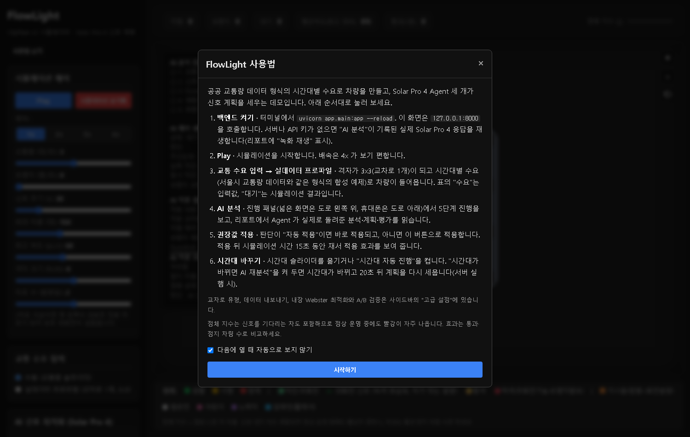

## 메인 화면

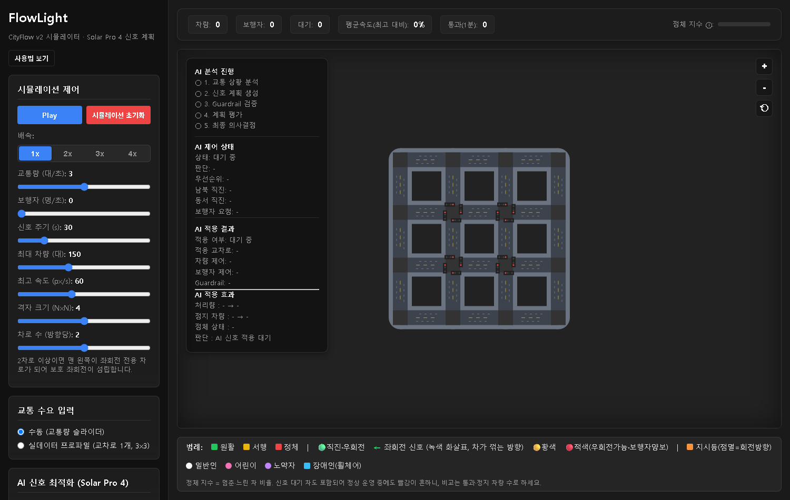

## 실데이터 프로파일 모드

격자가 3x3 교차로로 바뀌고, 접근로별 수요(입력)와 대기(시뮬레이션 결과)가 한 표에 나란히 표시됩니다.

| 프로파일 모드 | 접근로별 수요·발생률·진입·손실·대기 |
|---|---|
| 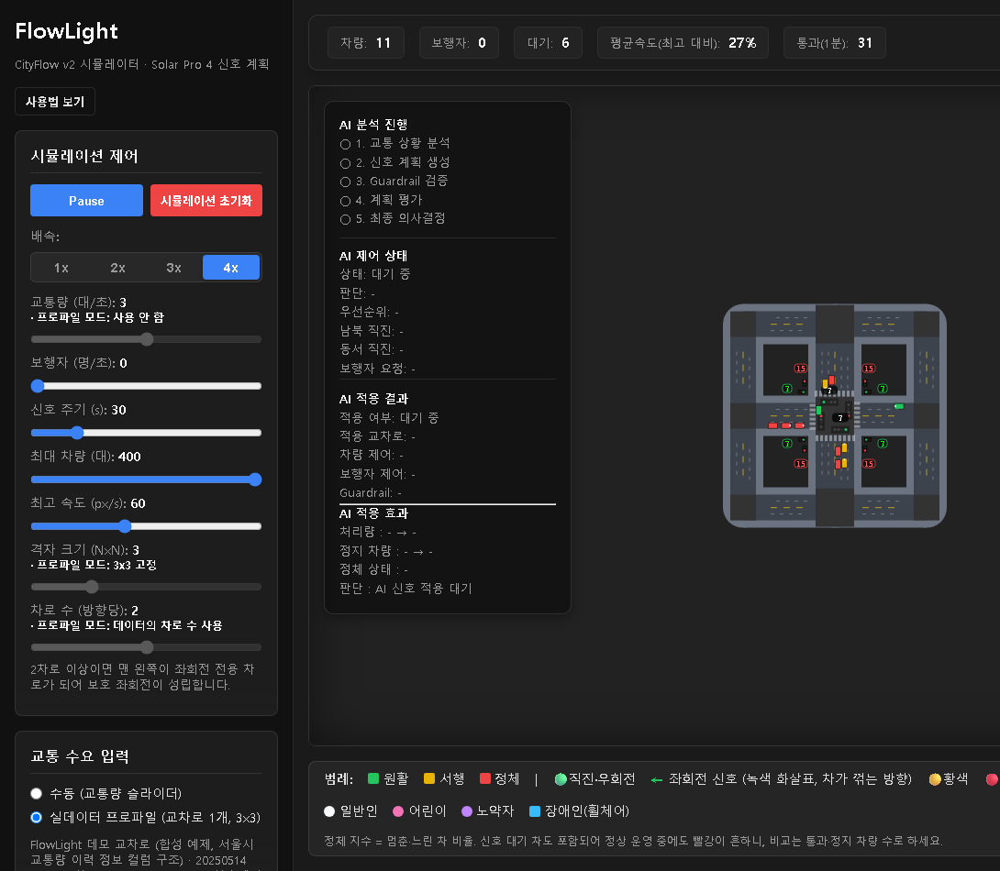 | 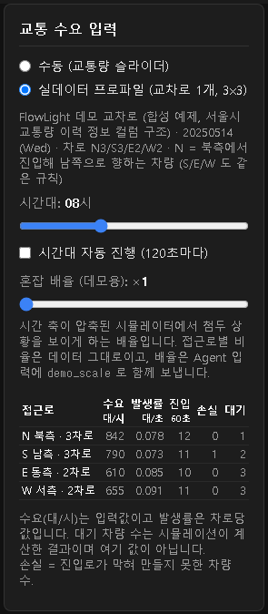 |

## AI 분석 진행 패널

| 2단계 진행 중 | 다섯 단계 완료 |
|---|---|
| 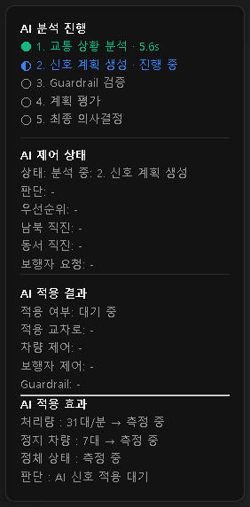 | 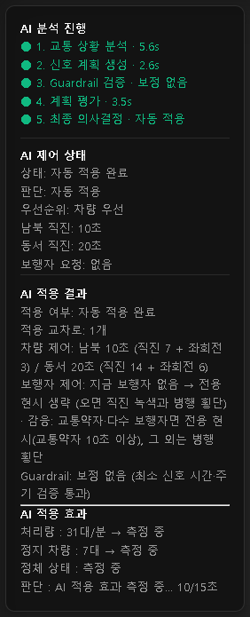 |

## 분석 리포트

Agent 가 실제로 돌려준 `summary` / `explanation` / `reason` 과 Guardrail 검증 결과가 그대로 표시됩니다.

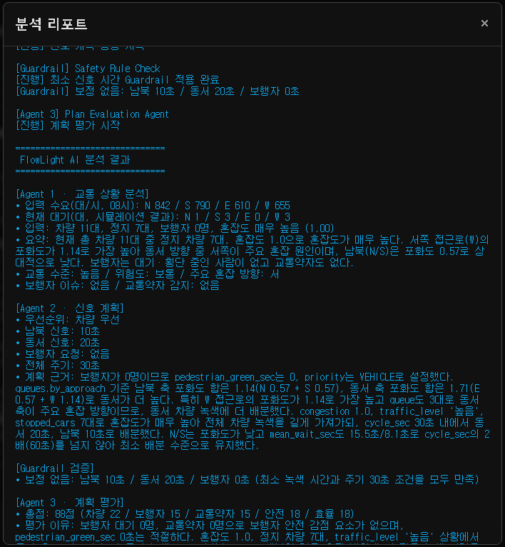

## 신호 적용

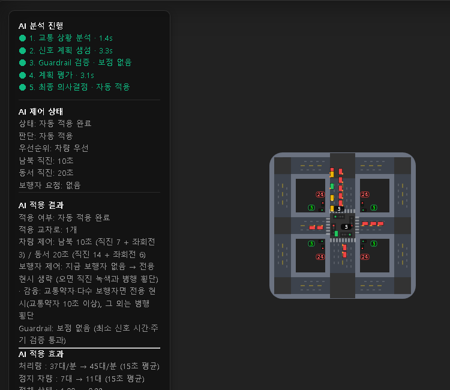

## 교통약자가 있을 때: 보행 전용 현시

횡단보도에 노약자가 서 있는 상태로 분석한 실제 실행입니다. Agent 1 이 교통약자를 감지했고, Agent 2 는 "교통약자 1명이 있어 횡단 속도를 고려해 10초" 라는 근거로 12/8/10 을 냈습니다. 적용 후 모든 차가 멈추고 모든 횡단보도가 10초 녹색이 되는 현시가 생겼습니다. 이후에는 감응 신호가 주기마다 횡단보도를 보고, 아무도 없는 교차로에서는 이 현시를 생략하고 교통약자가 오면 다시 10초를 켭니다.

| 리포트: 교통약자 감지와 계획 근거 | 적용 결과 패널 |
|---|---|
| 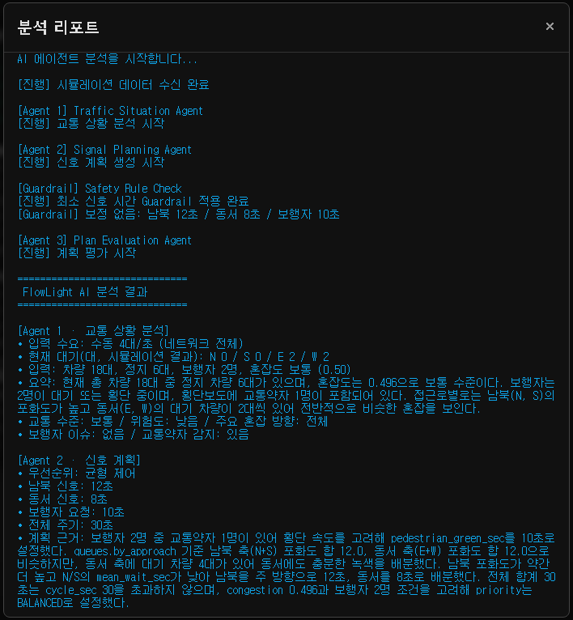 | 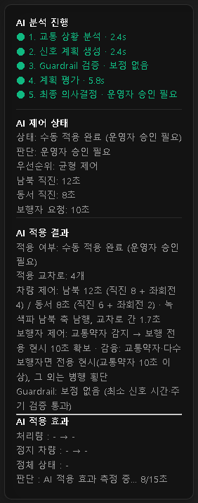 |

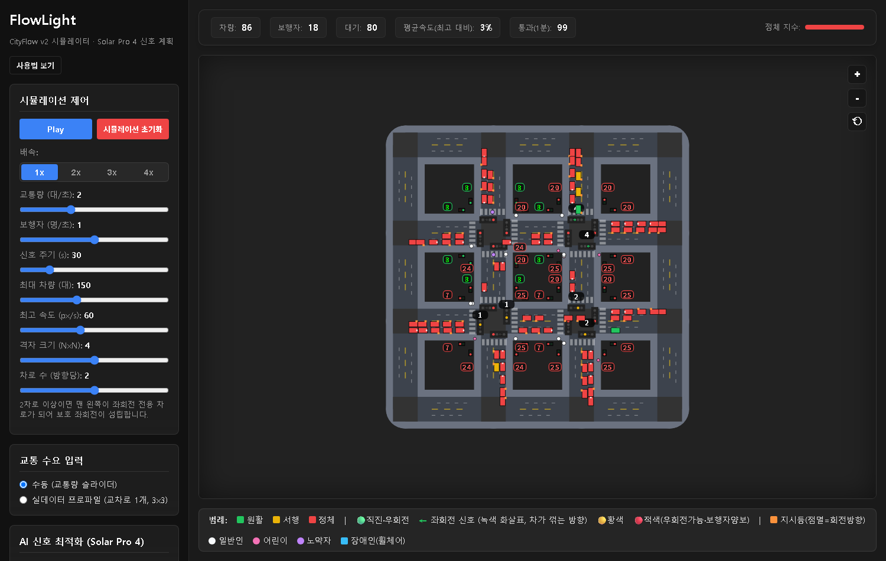

## 고급 설정

교차로 유형, 데이터 내보내기, 내장 Webster 최적화는 접기 안에 있습니다.

<p align="center">
  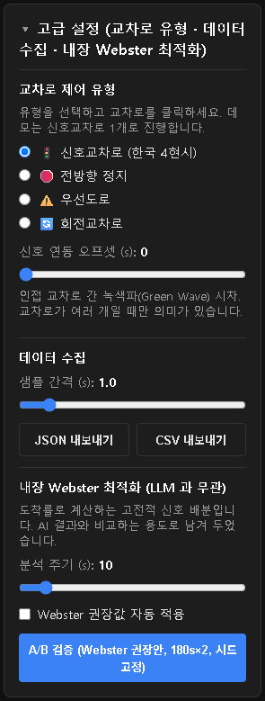
</p>

---

# 📄 발표 자료

프로젝트의 문제 정의, AI Agent 설계, 시스템 아키텍처, 실험 결과, 회고 내용을 발표 자료로 정리했습니다.

[📑 View Final Presentation](docs/FlowLight_Final_Presentation.pdf)

| Section | Description |
|--------|-------------|
| Problem | 고정형 교통 신호 체계의 한계 |
| Method | LLM Agent 기반 분석·계획·평가 구조 |
| Architecture | FastAPI, SSE, Solar API, Guardrail 기반 시스템 구성 |
| Experiment | AI 적용 전후 교통 흐름 비교 |
| Retrospective | 프로젝트를 통해 배운 점과 향후 개선 방향 |

---

# ⚠️ 알려진 한계

- 시뮬레이터는 픽셀 단위의 자체 구현으로, 비율(포화유출률 1800대/시/차로)은 현실과 맞추었지만 속도·거리 절대값은 현실과 다릅니다.
- 시간 축이 압축되어 있습니다. 주기 20~30초(실제 100~180초), 황색 2초, 교차로 간 녹색파 시차 1.7초. 비율은 실제와 비슷하지만 절대값은 다릅니다. 적용 후 실제 주기는 차량 녹색 합 + 좌회전·보행 현시 + 황색·전적색이라 입력 주기(`cycle_sec`)보다 깁니다.
- 방향당 차로가 하나라 좌회전 전용 차로가 없습니다. 그래서 겸용 좌회전을 쓰며, 감응 좌회전 현시는 대기가 두 대 이상일 때만 켭니다. 직진 때 좌회전을 막는 보호 전용 방식은 이 구조에서 격자를 마비시켜 채택하지 않았습니다.
- 감응으로 교차로마다 주기가 조금씩 달라지면 녹색파 시차는 흐트러집니다. 교차로별로 다른 계획을 세우는 것은 향후 계획입니다.
- 수동 모드에서 AI 적용 시 120초 동안 교통량을 절반으로 줄이는 완화 로직이 남아 있습니다(프로파일 모드에서는 비활성).
- 샘플 데이터는 실제 데이터셋의 컬럼 구조를 따른 **합성 예제**입니다. 실제 데이터 교체 절차는 `data/README.md` 에 있습니다.
- 첨두 시간대의 실제 수요로도 3x3 교차로 1개에서는 대기가 크지 않습니다. 혼잡을 강조하는 배율(`demo_scale`)과 회전비율(`turn_ratio`) 반영은 아직 적용하지 않았습니다.

---

# 🚀 향후 계획

| Improvement Area | Description |
|------------------|-------------|
| **Real Traffic Data** | 실제 공공 데이터 파일 연동, 회전비율(`turn_ratio`) 반영, 혼잡 강조 배율(`demo_scale`) |
| **Demo Packaging** | 프론트엔드 정적 서빙으로 실행 절차 단순화 |
| **Signal Fidelity** | 보행자 현시의 실제 적용과 주기 표시 정합성 |
| **Roundabout Scenario** | 회전교차로 차량 흐름과 우선순위 규칙 추가 |
| **Multi-Intersection Control** | 인접 교차로 간 신호 연동 및 녹색파 제어 확장 |
| **Reinforcement Learning** | LLM Agent 와 강화학습을 결합한 하이브리드 신호 최적화 |
| **Evaluation Automation** | 평균 속도, 대기 차량 수, 통행량 등 성능 지표 자동 수집 및 분석 |

---

# 👨‍💻 My Contributions

본 프로젝트에서 저는 **LLM Agent 설계, Backend 연동, Guardrail 검증, Frontend 연결, 실험 및 발표 자료 제작**을 중심으로 수행했습니다.

### AI / LLM
- Traffic Analysis Agent, Signal Planning Agent, Plan Evaluation Agent 구조 설계
- Upstage Solar API 기반 LLM 호출 흐름 구현
- 교통 상태 데이터를 LLM 입력에 적합한 Prompt 형식으로 변환
- JSON 기반 신호 계획 출력 형식 설계

### Backend
- FastAPI 기반 AI Agent 서버 구현
- Frontend와 통신하기 위한 API Endpoint 구성
- SSE(Server-Sent Events)를 활용한 실시간 스트리밍 응답 구현
- AI 분석 단계, 신호 계획 생성, 평가 결과를 순차적으로 전달하는 흐름 구성

### Reliability
- Guardrail을 통한 신호 시간 최소/최대 범위 검증
- JSON 응답 형식 검증
- 비정상 값 필터링 및 안전한 신호 계획만 적용하도록 처리
- 오류 발생 시 데모가 중단되지 않도록 예외 처리 보완

### Frontend / Demo
- HTML / JavaScript 기반 시뮬레이션 화면과 Backend 연동
- AI 분석 결과 및 신호 계획을 사용자 화면에 표시
- AI 적용 전 / 후 비교 시나리오 구성
- 전체 시뮬레이션 데모 영상 제작

### Documentation / Presentation
- 프로젝트 발표 자료 제작
- 시스템 아키텍처 및 AI 의사결정 과정 정리
- 실험 결과 분석 및 발표
- 최종 발표 진행

---

# 📝 Lessons Learned

이번 프로젝트를 통해 단순히 LLM API를 호출하는 것보다,
AI 결과를 **평가하고 검증한 뒤 서비스 흐름에 안전하게 연결하는 과정**이 더 중요하다는 점을 배웠습니다.

- LLM을 단순 질의응답이 아니라 **Agent 기반 의사결정 구조**로 설계하는 방법을 경험했습니다.
- Prompt Engineering과 Structured Outputs를 통해 AI가 **정해진 입력과 출력 형식**을 따르도록 설계했습니다.
- FastAPI와 SSE를 활용하여 AI의 분석 과정과 결과를 **실시간으로 사용자 화면에 전달**했습니다.
- Guardrail과 JSON Validation을 통해 AI가 생성한 결과를 **그대로 적용하지 않고 검증 후 적용**하는 구조를 구현했습니다.
- 실험 결과를 수치와 영상으로 함께 제시하는 것이 프로젝트 설득력에 중요하다는 점을 확인했습니다.

---

# 📄 라이선스

MIT 라이선스입니다. [LICENSE](LICENSE) 를 참고하세요.

---

# 👨‍💻 Developer

**Jihoon Lee**

GitHub

https://github.com/jihooni217
